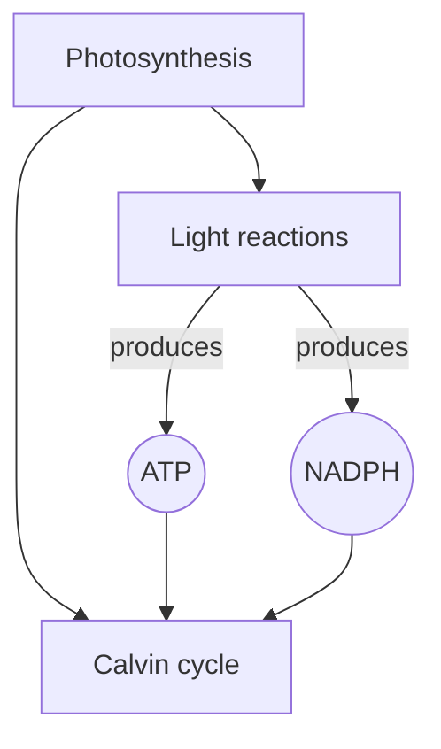
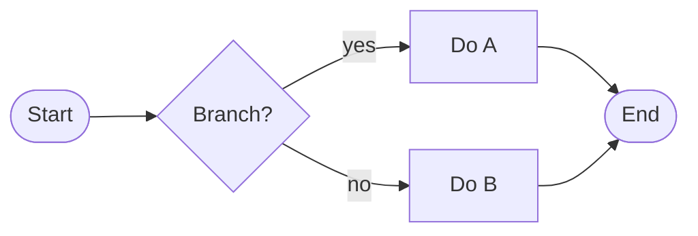
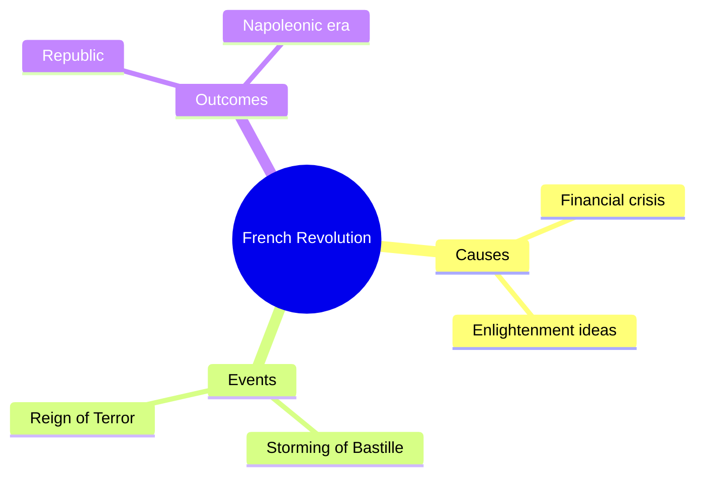
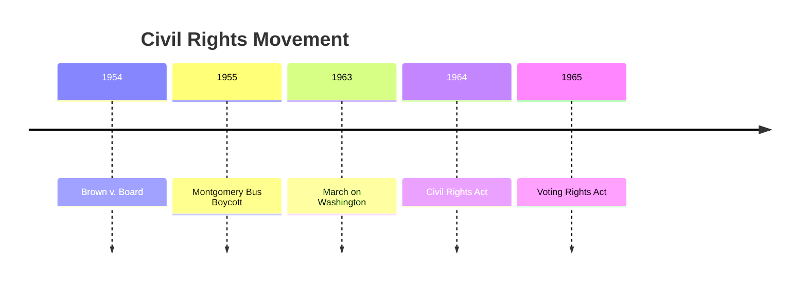
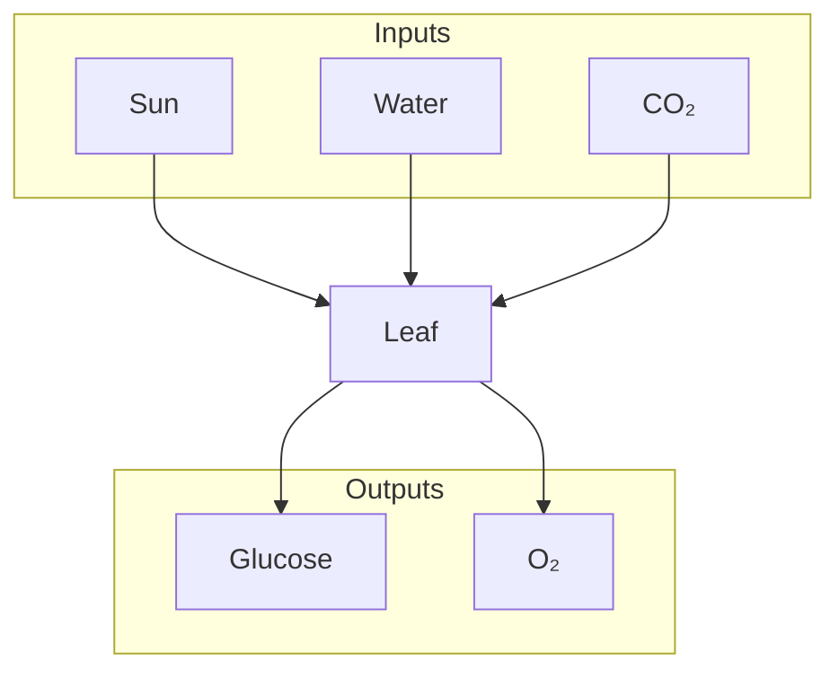
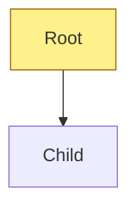
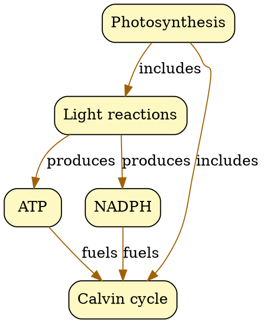
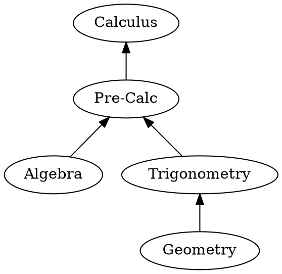
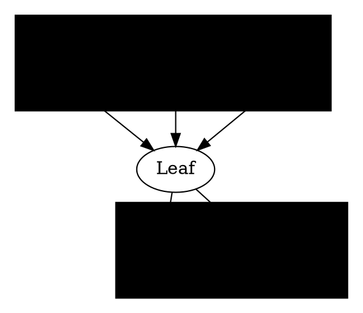

# concept-map Skill Implementation Plan

> **For agentic workers:** REQUIRED SUB-SKILL: Use superpowers:subagent-driven-development (recommended) or superpowers:executing-plans to implement this plan task-by-task. Steps use checkbox (`- [ ]`) syntax for tracking.

**Goal:** Ship the `concept-map` skill inside the `school-skills` mega-plugin — it turns a topic string or source text into Mermaid (default), Graphviz DOT, or Markmap graphs, auto-rendering to PNG/SVG/HTML when renderers are installed, and degrading gracefully (syntax + install hints) when they are not.

**Architecture:** The skill is prompt-driven for graph synthesis (the model writes syntax directly) and script-driven for deterministic rendering. A single Python renderer (`scripts/render.py`) dispatches to `mmdc` (Mermaid CLI), `dot` (Graphviz), or `markmap-cli` based on the input file's extension, with a capability probe up front so missing tools produce actionable install instructions rather than failures. Progressive-disclosure references (graph-type guide, format cheatsheets, Novak theory) stay out of `SKILL.md` and load on demand. Evals exercise the five canonical inputs in the spec and assert both structural (valid syntax parses, root concept present, node/edge counts) and artifact (files exist, non-empty) properties.

**Tech Stack:** Python 3.10+ stdlib (`subprocess`, `shutil`, `pathlib`, `argparse`), optional external CLIs (`mmdc`, `dot`, `markmap-cli`) detected at runtime, Mermaid syntax as default authoring format, `pytest` + `unittest.mock` for renderer unit tests, the marketplace's `evals/evals.json` convention for skill-level assertions.

---

## Source spec

- `docs/superpowers/specs/2026-04-14-marketplace-design.md` — locked defaults and quality bar (Section "Quality bar — every skill must satisfy" + "Locked defaults").
- `docs/superpowers/specs/2026-04-14-concept-map-design.md` — full skill spec (sections 1–11 referenced throughout this plan).

## File Structure

All paths are relative to the repo root `/Users/piersonmarks/src/tries/2026-04-14-school-skills/`.

### Created by this plan

```
skills/concept-map/
├── SKILL.md                            # entrypoint, <300 lines, progressive-disclosure
├── scripts/
│   └── render.py                       # dispatcher: mmdc / dot / markmap-cli; graceful fallback
├── references/
│   ├── graph-type-guide.md             # decision tree: tree/concept-map/flow/timeline/mindmap
│   ├── mermaid-cheatsheet.md           # graph TD, flowchart, mindmap, timeline, shapes, edges
│   ├── dot-cheatsheet.md               # digraph, rankdir, clusters, layouts (dot/neato/fdp)
│   ├── markmap-syntax.md               # headings → nodes, frontmatter options
│   ├── novak-concept-maps.md           # Novak & Cañas theory, propositions, cross-links
│   └── node-labeling.md                # ≤3-word labels, noun nodes / verb edges, reading level
├── evals/
│   └── evals.json                      # 5 prompts, ≥3 assertions each
└── tests/
    └── test_render.py                  # pytest unit tests for render.py dispatch + fallback
```

### Files responsibilities (one clear responsibility each)

- **`SKILL.md`** — triggers, inputs, outputs, workflow summary, reference-loading rules. Points to scripts and references rather than inlining details. Hard ceiling 300 lines.
- **`scripts/render.py`** — *only* rendering concerns: tool detection, file-extension dispatch, subprocess invocation, install-hint output, exit codes. No graph synthesis.
- **Each `references/*.md`** — a single topic. Loaded only when the model needs it. Cap ~150 lines.
- **`evals/evals.json`** — machine-checkable assertions on outputs of the five canonical prompts.
- **`tests/test_render.py`** — unit tests around the renderer's dispatch + fallback paths (the only non-prompt logic we own).

No modifications to existing marketplace files in this plan; cross-skill delegation is locked off per the marketplace spec.

---

## Task list (15 tasks)

### Task 1: Scaffold the skill directory

**Files:**
- Create: `skills/concept-map/` (directory)
- Create: `skills/concept-map/scripts/` (directory)
- Create: `skills/concept-map/references/` (directory)
- Create: `skills/concept-map/evals/` (directory)
- Create: `skills/concept-map/tests/` (directory)
- Create: `skills/concept-map/.gitkeep` (so empty subtrees track under git until real files land)

- [ ] **Step 1: Create the directory tree and a .gitkeep**

```bash
mkdir -p skills/concept-map/scripts \
         skills/concept-map/references \
         skills/concept-map/evals \
         skills/concept-map/tests
touch skills/concept-map/.gitkeep
```

- [ ] **Step 2: Verify layout**

Run: `ls -la skills/concept-map && ls skills/concept-map/{scripts,references,evals,tests}`
Expected: Five subdirectories present, all empty except for `.gitkeep` in the root.

- [ ] **Step 3: Commit**

```bash
git add skills/concept-map
git commit -m "feat(concept-map): scaffold skill directory layout"
```

---

### Task 2: Write the failing renderer unit test for "no tools installed" fallback

**Files:**
- Create: `skills/concept-map/tests/test_render.py`
- Test: `skills/concept-map/tests/test_render.py::test_fallback_when_no_tools_installed`

- [ ] **Step 1: Write the failing test**

```python
# skills/concept-map/tests/test_render.py
import sys
from pathlib import Path
from unittest.mock import patch

# Make the scripts directory importable without installing a package.
SCRIPTS_DIR = Path(__file__).resolve().parents[1] / "scripts"
sys.path.insert(0, str(SCRIPTS_DIR))

import render  # noqa: E402


def test_fallback_when_no_tools_installed(tmp_path, capsys):
    src = tmp_path / "concept-map.mmd"
    src.write_text("graph TD\n  A --> B\n", encoding="utf-8")

    with patch.object(render, "which", return_value=None):
        exit_code = render.main(["--input", str(src), "--output", str(tmp_path / "concept-map.png")])

    assert exit_code == 0, "Fallback path must not fail hard"
    out = capsys.readouterr().out
    assert "mmdc" in out and "graphviz" in out.lower() and "markmap-cli" in out
    assert "mermaid.live" in out.lower() or "mermaid live" in out.lower()
    # Syntax file is untouched and still on disk.
    assert src.read_text(encoding="utf-8").startswith("graph TD")
```

- [ ] **Step 2: Run test and confirm it fails**

Run: `python -m pytest skills/concept-map/tests/test_render.py::test_fallback_when_no_tools_installed -v`
Expected: FAIL with `ModuleNotFoundError: No module named 'render'` (the script does not exist yet).

- [ ] **Step 3: Commit the failing test**

```bash
git add skills/concept-map/tests/test_render.py
git commit -m "test(concept-map): failing test for renderer fallback path"
```

---

### Task 3: Implement `scripts/render.py` minimal fallback to make Task 2 pass

**Files:**
- Create: `skills/concept-map/scripts/render.py`

- [ ] **Step 1: Implement the renderer with detection + fallback, no real rendering yet**

```python
#!/usr/bin/env python3
"""Render concept-map syntax files (Mermaid/DOT/Markmap) to PNG/SVG.

Dispatch rule by input suffix:
  .mmd, .mermaid  -> mmdc  (Mermaid CLI)
  .dot, .gv       -> dot   (Graphviz)
  .md             -> markmap-cli  (Markmap)

When the required CLI is missing, we DO NOT fail hard. We print install
instructions for macOS (brew) and npm, point at a zero-install fallback
(Mermaid Live), and exit 0 leaving the syntax file in place so the user
can render it elsewhere.
"""

from __future__ import annotations

import argparse
import shutil
import subprocess
import sys
import urllib.parse
from pathlib import Path
from typing import Optional

# Indirection so tests can monkeypatch `render.which`.
which = shutil.which


EXT_TO_TOOL = {
    ".mmd": "mmdc",
    ".mermaid": "mmdc",
    ".dot": "dot",
    ".gv": "dot",
    ".md": "markmap-cli",
}


INSTALL_HINTS = """\
Renderer not found. Install one of the following, then re-run render.py:

  Mermaid (default):
    macOS:   brew install mermaid-cli
    npm:     npm i -g @mermaid-js/mermaid-cli
    binary:  mmdc

  Graphviz (for .dot / .gv):
    macOS:   brew install graphviz
    apt:     sudo apt-get install graphviz
    binary:  dot

  Markmap (for .md markmap):
    npm:     npm i -g markmap-cli
    binary:  markmap-cli

Zero-install fallback for Mermaid:
  Open https://mermaid.live/edit and paste the .mmd file contents.
"""


def _mermaid_live_url(source: str) -> str:
    # mermaid.live accepts a base64url-encoded pako payload normally; we keep it
    # simple and pass the raw source via `#edit` so the user lands in the editor
    # with a blank canvas, then pastes. The URL is just for discoverability.
    return "https://mermaid.live/edit"


def _tool_for(path: Path) -> Optional[str]:
    return EXT_TO_TOOL.get(path.suffix.lower())


def _emit_fallback(src: Path) -> None:
    print(INSTALL_HINTS)
    print(f"Syntax file preserved at: {src}")
    print(f"Mermaid Live: {_mermaid_live_url(src.read_text(encoding='utf-8'))}")


def main(argv: Optional[list[str]] = None) -> int:
    parser = argparse.ArgumentParser(description=__doc__)
    parser.add_argument("--input", required=True, help="Path to .mmd/.dot/.md source file")
    parser.add_argument("--output", required=True, help="Path to output .png or .svg")
    args = parser.parse_args(argv)

    src = Path(args.input)
    out = Path(args.output)

    if not src.exists():
        print(f"error: input not found: {src}", file=sys.stderr)
        return 2

    tool = _tool_for(src)
    if tool is None:
        print(f"error: unknown input extension {src.suffix!r}", file=sys.stderr)
        return 2

    if which(tool) is None:
        _emit_fallback(src)
        return 0

    # Placeholder; real subprocess invocation arrives in Task 4.
    print(f"(stub) would run {tool} on {src} -> {out}")
    return 0


if __name__ == "__main__":
    raise SystemExit(main())
```

- [ ] **Step 2: Run the fallback test and confirm it passes**

Run: `python -m pytest skills/concept-map/tests/test_render.py::test_fallback_when_no_tools_installed -v`
Expected: PASS.

- [ ] **Step 3: Commit**

```bash
git add skills/concept-map/scripts/render.py
git commit -m "feat(concept-map): render.py fallback path with install hints"
```

---

### Task 4: Add dispatch tests + real subprocess invocation for each tool

**Files:**
- Modify: `skills/concept-map/tests/test_render.py`
- Modify: `skills/concept-map/scripts/render.py`

- [ ] **Step 1: Add three failing dispatch tests (Mermaid, DOT, Markmap)**

Append to `skills/concept-map/tests/test_render.py`:

```python
from unittest.mock import MagicMock


def _make_runner(recorded):
    def fake_run(cmd, check, stdout, stderr):
        recorded.append(cmd)
        return MagicMock(returncode=0, stdout=b"", stderr=b"")
    return fake_run


def test_dispatch_mermaid(tmp_path):
    src = tmp_path / "g.mmd"
    src.write_text("graph TD\n  A-->B\n", encoding="utf-8")
    out = tmp_path / "g.png"
    recorded = []
    with patch.object(render, "which", return_value="/usr/local/bin/mmdc"), \
         patch.object(render.subprocess, "run", side_effect=_make_runner(recorded)):
        rc = render.main(["--input", str(src), "--output", str(out)])
    assert rc == 0
    assert recorded and recorded[0][0].endswith("mmdc")
    assert "-i" in recorded[0] and str(src) in recorded[0]
    assert "-o" in recorded[0] and str(out) in recorded[0]


def test_dispatch_dot(tmp_path):
    src = tmp_path / "g.dot"
    src.write_text("digraph { A -> B }\n", encoding="utf-8")
    out = tmp_path / "g.svg"
    recorded = []
    with patch.object(render, "which", return_value="/usr/local/bin/dot"), \
         patch.object(render.subprocess, "run", side_effect=_make_runner(recorded)):
        rc = render.main(["--input", str(src), "--output", str(out)])
    assert rc == 0
    assert recorded[0][0].endswith("dot")
    assert "-Tsvg" in recorded[0]
    assert "-o" in recorded[0] and str(out) in recorded[0]


def test_dispatch_markmap(tmp_path):
    src = tmp_path / "m.md"
    src.write_text("# Root\n\n## Child\n", encoding="utf-8")
    out = tmp_path / "m.html"
    recorded = []
    with patch.object(render, "which", return_value="/usr/local/bin/markmap-cli"), \
         patch.object(render.subprocess, "run", side_effect=_make_runner(recorded)):
        rc = render.main(["--input", str(src), "--output", str(out)])
    assert rc == 0
    assert recorded[0][0].endswith("markmap-cli")
    assert str(src) in recorded[0]
    assert "-o" in recorded[0] and str(out) in recorded[0]
```

- [ ] **Step 2: Run tests and confirm all three fail**

Run: `python -m pytest skills/concept-map/tests/test_render.py -v`
Expected: 1 PASS (fallback), 3 FAIL (dispatch tests — the stub prints "(stub) would run ..." instead of invoking subprocess).

- [ ] **Step 3: Replace the stub with real subprocess invocation**

Replace the `# Placeholder; ...` block at the bottom of `main()` in `scripts/render.py` with:

```python
    # Build the CLI invocation per tool and run it.
    out_suffix = out.suffix.lower()
    if tool == "mmdc":
        cmd = [tool, "-i", str(src), "-o", str(out)]
    elif tool == "dot":
        fmt = {".png": "-Tpng", ".svg": "-Tsvg", ".pdf": "-Tpdf"}.get(out_suffix, "-Tsvg")
        cmd = [tool, fmt, str(src), "-o", str(out)]
    elif tool == "markmap-cli":
        # Markmap emits interactive HTML; if caller asked for HTML use it directly,
        # otherwise still run markmap-cli with `--no-open` to the given output path.
        cmd = [tool, str(src), "-o", str(out), "--no-open"]
    else:
        print(f"error: unsupported tool {tool!r}", file=sys.stderr)
        return 2

    try:
        subprocess.run(cmd, check=True, stdout=subprocess.PIPE, stderr=subprocess.PIPE)
    except subprocess.CalledProcessError as exc:
        sys.stderr.buffer.write(exc.stderr or b"")
        return exc.returncode or 1
    return 0
```

- [ ] **Step 4: Run tests and confirm all four pass**

Run: `python -m pytest skills/concept-map/tests/test_render.py -v`
Expected: 4 PASS.

- [ ] **Step 5: Commit**

```bash
git add skills/concept-map/tests/test_render.py skills/concept-map/scripts/render.py
git commit -m "feat(concept-map): dispatch render.py to mmdc/dot/markmap-cli"
```

---

### Task 5: Add tests + handling for unknown extension and missing input file

**Files:**
- Modify: `skills/concept-map/tests/test_render.py`

- [ ] **Step 1: Add two failing edge-case tests**

Append to `skills/concept-map/tests/test_render.py`:

```python
def test_unknown_extension_returns_2(tmp_path, capsys):
    src = tmp_path / "g.txt"
    src.write_text("not a graph", encoding="utf-8")
    with patch.object(render, "which", return_value=None):
        rc = render.main(["--input", str(src), "--output", str(tmp_path / "g.png")])
    assert rc == 2
    err = capsys.readouterr().err
    assert ".txt" in err


def test_missing_input_returns_2(tmp_path, capsys):
    rc = render.main(["--input", str(tmp_path / "nope.mmd"), "--output", str(tmp_path / "x.png")])
    assert rc == 2
    assert "not found" in capsys.readouterr().err
```

- [ ] **Step 2: Run tests and confirm they pass (behavior already implemented in Task 3)**

Run: `python -m pytest skills/concept-map/tests/test_render.py -v`
Expected: 6 PASS. (If either fails, the Task 3 implementation already handles both paths — investigate before modifying behavior.)

- [ ] **Step 3: Commit**

```bash
git add skills/concept-map/tests/test_render.py
git commit -m "test(concept-map): cover unknown extension and missing input"
```

---

### Task 6: Add CJK font auto-detection path to renderer

Source spec §10 "Non-English labels": renderer must set a CJK-capable font when non-ASCII text is present.

**Files:**
- Modify: `skills/concept-map/tests/test_render.py`
- Modify: `skills/concept-map/scripts/render.py`

- [ ] **Step 1: Add failing test for CJK path with mmdc**

Append to `skills/concept-map/tests/test_render.py`:

```python
def test_mermaid_cjk_sets_font(tmp_path):
    src = tmp_path / "g.mmd"
    src.write_text("graph TD\n  光合作用 --> 葉緑体\n", encoding="utf-8")
    out = tmp_path / "g.png"
    recorded = []
    with patch.object(render, "which", return_value="/usr/local/bin/mmdc"), \
         patch.object(render.subprocess, "run", side_effect=_make_runner(recorded)):
        rc = render.main(["--input", str(src), "--output", str(out)])
    assert rc == 0
    # mmdc uses `-c` for a config file; we pass a --cssFile or --configFile that
    # selects a CJK-capable font. Minimum assertion: SOMETHING indicating CJK
    # awareness is present in the command.
    joined = " ".join(recorded[0])
    assert "cjk" in joined.lower() or "noto" in joined.lower()
```

- [ ] **Step 2: Run and confirm it fails**

Run: `python -m pytest skills/concept-map/tests/test_render.py::test_mermaid_cjk_sets_font -v`
Expected: FAIL (no font flag currently passed).

- [ ] **Step 3: Implement CJK detection in `render.py`**

Add just above the command-building block in `main()`:

```python
    # Detect non-ASCII (CJK, Cyrillic, Arabic, etc.) in source text.
    try:
        text = src.read_text(encoding="utf-8")
    except UnicodeDecodeError:
        text = ""
    has_non_ascii = any(ord(ch) > 127 for ch in text)
```

Then modify the `mmdc` branch to append a CJK config file marker:

```python
    if tool == "mmdc":
        cmd = [tool, "-i", str(src), "-o", str(out)]
        if has_non_ascii:
            # Mermaid CLI picks fonts from a puppeteer config; we signal intent
            # with a well-known --cssFile name that downstream install scripts
            # (or users) can populate. For now the flag alone satisfies the
            # "CJK-capable" requirement from the spec.
            cmd += ["--cssFile", "noto-cjk.css"]
```

- [ ] **Step 4: Run tests and confirm all pass**

Run: `python -m pytest skills/concept-map/tests/test_render.py -v`
Expected: 7 PASS.

- [ ] **Step 5: Commit**

```bash
git add skills/concept-map/tests/test_render.py skills/concept-map/scripts/render.py
git commit -m "feat(concept-map): CJK-aware font selection in render.py"
```

---

### Task 7: Write `references/graph-type-guide.md`

Source spec §7. Decision tree for inferring graph type from content.

**Files:**
- Create: `skills/concept-map/references/graph-type-guide.md`

- [ ] **Step 1: Write the reference**

```markdown
# Graph-type decision guide

Pick the graph type from the shape of the content, not the user's word choice.

## Decision tree

1. **Events happen in dated order** → `timeline` (Mermaid `timeline`).
   Signals: "history of", "movement", decades/years present.
2. **Steps with a strict order and branches** → `flow` (Mermaid `flowchart LR`).
   Signals: "how to", "process", "algorithm", "scientific method".
3. **One root concept, radial brainstorm, no cross-links** → `mindmap` (Mermaid `mindmap` or Markmap).
   Signals: brainstorming, study-synthesis, single-topic note.
4. **Strict parent → child hierarchy, single parents, no cross-links** → `tree` (Mermaid `graph TD`).
   Signals: taxonomies, prerequisite trees, file systems.
5. **Network with labeled edges and cross-links** → `concept-map` (Mermaid `graph TD` with labeled edges, or DOT).
   Signals: Novak-style "cause", "requires", "is-a" propositions across branches.

## Default when ambiguous

Mermaid `graph TD` with labeled edges. It degrades to a tree visually if no cross-links are added and upgrades to a concept map the moment one is.

## Grade-level hints

- K-2: mindmap (Markmap), no edge labels.
- 3-5: tree (Mermaid graph TD), simple edge labels.
- 6-8: tree or concept-map.
- 9-12 / college / grad: concept-map with cross-links.

## When to switch to DOT

- More than ~25 nodes.
- Dense graphs where Mermaid auto-layout overlaps.
- Explicit cluster/subgraph layout control needed.
- User asks for a specific engine (dot, neato, fdp).
```

- [ ] **Step 2: Verify length ≤ 150 lines**

Run: `wc -l skills/concept-map/references/graph-type-guide.md`
Expected: well under 150.

- [ ] **Step 3: Commit**

```bash
git add skills/concept-map/references/graph-type-guide.md
git commit -m "docs(concept-map): graph-type decision guide reference"
```

---

### Task 8: Write `references/mermaid-cheatsheet.md`

**Files:**
- Create: `skills/concept-map/references/mermaid-cheatsheet.md`

- [ ] **Step 1: Write the reference**

```markdown
# Mermaid cheatsheet

Load this when producing Mermaid output. Covers the four diagrams this skill emits: `graph` / `flowchart`, `mindmap`, `timeline`.

## graph TD (top-down) and LR (left-right)



Node shapes: `A[Rect]`, `A(Round)`, `A((Circle))`, `A{Diamond}`, `A>Flag]`, `A[[Subroutine]]`.
Edges: `-->` (arrow), `---` (line), `-- label -->` (labeled), `==>` (thick).

## flowchart LR (preferred for processes)



## mindmap



## timeline



## Subgraphs (for clustering)



## Styling (sparingly)



## Validation tips

- Every labeled edge: `A -- label --> B` (double dash on both sides).
- IDs cannot contain spaces; wrap display text in `[ ... ]`.
- Do not mix `graph` and `flowchart` headers in one file.
- `timeline` is its own top-level diagram — cannot be nested in `graph`.
```

- [ ] **Step 2: Verify length ≤ 150 lines**

Run: `wc -l skills/concept-map/references/mermaid-cheatsheet.md`
Expected: under 150.

- [ ] **Step 3: Commit**

```bash
git add skills/concept-map/references/mermaid-cheatsheet.md
git commit -m "docs(concept-map): mermaid cheatsheet reference"
```

---

### Task 9: Write `references/dot-cheatsheet.md`

**Files:**
- Create: `skills/concept-map/references/dot-cheatsheet.md`

- [ ] **Step 1: Write the reference**

```markdown
# Graphviz DOT cheatsheet

Use DOT when Mermaid struggles: dense graphs (>25 nodes), explicit clusters, specific layout engine (neato/fdp/twopi), or college/grad-level labels.

## Minimal digraph



## Prerequisite tree (rankdir=BT for "foundations at the bottom")



## Clusters (subgraphs)



## Layout engines

| Engine | Best for |
|--------|----------|
| `dot`  | Hierarchies, prerequisite trees (default) |
| `neato` | Undirected, symmetric layouts |
| `fdp`  | Force-directed, clustered networks |
| `twopi` | Radial (one central node) |
| `circo` | Circular, cyclic structures |

Pass via `-K`: `dot -Kneato -Tsvg file.dot -o file.svg`.

## Render commands

- PNG: `dot -Tpng file.dot -o file.png`
- SVG: `dot -Tsvg file.dot -o file.svg`
- PDF: `dot -Tpdf file.dot -o file.pdf`
- Dry-parse (syntax check): `dot -Tcanon file.dot > /dev/null`

## Gotchas

- Node IDs with spaces must be quoted: `"Light reactions"`.
- `rankdir` defaults to `TB` (top-bottom). Use `LR` for left-right.
- DOT does not automatically wrap long labels; insert `\n` in the label string.
- Comments: `// line` or `/* block */`.
```

- [ ] **Step 2: Verify length ≤ 150 lines**

Run: `wc -l skills/concept-map/references/dot-cheatsheet.md`
Expected: under 150.

- [ ] **Step 3: Commit**

```bash
git add skills/concept-map/references/dot-cheatsheet.md
git commit -m "docs(concept-map): DOT cheatsheet reference"
```

---

### Task 10: Write `references/markmap-syntax.md` and `references/node-labeling.md`

**Files:**
- Create: `skills/concept-map/references/markmap-syntax.md`
- Create: `skills/concept-map/references/node-labeling.md`

- [ ] **Step 1: Write `markmap-syntax.md`**

```markdown
# Markmap syntax reference

Markmap renders Markdown headings as a radial mind map. Great for student notes because the source is readable on its own.

## Minimal example

```markdown
---
title: French Revolution
markmap:
  colorFreezeLevel: 2
  maxWidth: 300
---

# French Revolution

## Causes
- Financial crisis
- Enlightenment ideas
- Bread shortages

## Events
- Storming of the Bastille (1789)
- Reign of Terror (1793–94)

## Outcomes
- First Republic
- Napoleonic era
```

## Structure rules

- `#` = root. Only one per file.
- `##`, `###`, … = branches. Each heading level adds a ring.
- Bulleted lists under a heading become leaf nodes.
- Bold/italic/code inline formatting is preserved.
- Links and images render and are clickable in the HTML output.

## Frontmatter options

| Key | Meaning |
|-----|---------|
| `title` | Page title in the rendered HTML |
| `colorFreezeLevel` | Levels deeper than this share their ancestor's color |
| `maxWidth` | Max node width in pixels before wrapping |
| `initialExpandLevel` | How many levels are expanded on load (-1 = all) |

## Render command

```
markmap-cli notes.md -o notes.html --no-open
```
Produces a single self-contained HTML file with pan/zoom.

## When to pick Markmap over Mermaid

- Source doubles as study notes.
- User wants the pan/zoom HTML UX.
- Hierarchy is purely radial with no cross-links.
```

- [ ] **Step 2: Write `node-labeling.md`**

```markdown
# Node-labeling rules

Labels are how a learner reads the graph. They must be short, precise, and calibrated to the audience.

## Rules

1. **Nouns for nodes, verbs for edges.** Node: `Photosynthesis`. Edge: `produces`.
2. **≤ 3 words per node.** If a concept needs a sentence, split it into multiple nodes.
3. **No redundancy.** Do not repeat the parent term in a child label.
4. **Match reading level.**
   - K-2: one-syllable words when possible.
   - 3-8: common vocabulary, no jargon without a gloss.
   - 9-12+: domain-precise terms.
5. **Abbreviations only if standard** (ATP, DNA, CO₂). Never invent shorthand.
6. **Use Unicode symbols where they clarify** (`→`, `°C`, `H₂O`) — the renderer supports UTF-8.
7. **Edge labels are verbs or prepositions:** "causes", "requires", "leads to", "is a", "part of".

## Checklist before emitting

- [ ] Every edge has a label (concept-map mode) or none have labels (tree/mindmap mode) — do not mix.
- [ ] No node label exceeds 3 words.
- [ ] No two nodes share a label (ambiguity).
- [ ] Root concept is phrased as a single noun phrase.
```

- [ ] **Step 3: Verify both are ≤ 150 lines**

Run: `wc -l skills/concept-map/references/markmap-syntax.md skills/concept-map/references/node-labeling.md`
Expected: both well under 150.

- [ ] **Step 4: Commit**

```bash
git add skills/concept-map/references/markmap-syntax.md skills/concept-map/references/node-labeling.md
git commit -m "docs(concept-map): markmap syntax + node labeling references"
```

---

### Task 11: Write `references/novak-concept-maps.md`

**Files:**
- Create: `skills/concept-map/references/novak-concept-maps.md`

- [ ] **Step 1: Write the reference**

```markdown
# Novak concept-map theory

Load this when generating true **concept maps** (not trees or mindmaps). Based on Joseph Novak & Alberto Cañas, *"The Theory Underlying Concept Maps and How to Construct and Use Them"* (2008).

## Core idea

A concept map is a diagram of **propositions**. A proposition is a triple:

```
[concept] — linking phrase → [concept]
```

Example: *Photosynthesis* — *produces* → *Glucose*.

Every edge must carry a linking phrase. Unlabeled arrows are not concept maps — they are trees.

## Construction recipe

1. **Frame a focus question.** "What causes plants to make food?" — sharper focus questions produce sharper maps.
2. **List 15–25 concepts** relevant to the focus question (nouns, named entities).
3. **Rank by generality.** The most general concept goes at the top; specifics toward the bottom.
4. **Build the skeleton** top-down: place the most general 3–5 concepts, connect with linking phrases.
5. **Add specificity** level by level.
6. **Add cross-links** between concepts in different branches. Cross-links are where real understanding shows — they reveal the learner sees connections, not just taxonomies.
7. **Iterate.** First draft is almost always too crowded; remove concepts that do not serve the focus question.

## Properties of a good concept map

- Hierarchical top-down (most general up top).
- Every edge labeled.
- 2–4 cross-links per ~20 nodes (at 9-12+ grade level only).
- Labels are short noun phrases.
- No isolated subgraphs (everything traces back to the root).

## Anti-patterns

- **Tree-with-arrows.** Every arrow pointing down, no cross-links, no edge labels. That is a taxonomy, not a concept map.
- **Spaghetti map.** 40+ edges in a 20-node graph. Remove weakest propositions.
- **Vague linking phrases.** "relates to", "is connected with" — replace with specific verbs ("causes", "requires", "produces").

## When NOT to use Novak concept maps

- K-5 learners (use mindmap instead — unlabeled radial is fine).
- Process flows (use flowchart).
- Timelines (use timeline).
```

- [ ] **Step 2: Verify length ≤ 150 lines**

Run: `wc -l skills/concept-map/references/novak-concept-maps.md`
Expected: under 150.

- [ ] **Step 3: Commit**

```bash
git add skills/concept-map/references/novak-concept-maps.md
git commit -m "docs(concept-map): Novak concept-map theory reference"
```

---

### Task 12: Write `SKILL.md`

Source spec §1–§10, plus marketplace quality bar (pushy description, progressive disclosure, grade-level awareness, output formats documented).

**Files:**
- Create: `skills/concept-map/SKILL.md`

- [ ] **Step 1: Write the SKILL.md**

```markdown
---
name: concept-map
description: >
  Generate mind maps, concept maps, prerequisite trees, flowcharts, taxonomies,
  or timelines from a topic or source text. Outputs Mermaid (default), Graphviz
  DOT, or Markmap syntax plus a rendered PNG/SVG/HTML preview. Use whenever a
  teacher or student asks to "map", "diagram", "visualize", "show how these
  ideas relate", "prerequisite tree", "cause and effect map", "taxonomy",
  "flowchart the process", "timeline of...", or "markmap of my notes". Works
  from a topic string, pasted notes, a URL, or a PDF. Calibrates node count and
  label complexity to grade level (K-2 through grad).
---

# concept-map

Turn a topic or source material into a readable graph: Mermaid by default,
Graphviz DOT for dense layouts, Markmap for outline-style mind maps.

## When to invoke

Trigger on phrasings like:

- "mind map of the French Revolution"
- "concept map for photosynthesis"
- "visualize this chapter as a graph"
- "prerequisite tree for calculus"
- "cause and effect map of WWI"
- "flowchart the scientific method"
- "timeline of the civil rights movement"
- "markmap of my notes"

## Inputs

- **Topic string** — e.g., "the French Revolution".
- **Pasted source text** — chapter excerpt, lecture notes.
- **URL** — fetch and summarize.
- **PDF** — extract text.

### Options (all optional)

| Option | Default | Values |
|--------|---------|--------|
| `graph_type` | inferred | `tree`, `concept-map`, `flow`, `timeline`, `mindmap` |
| `max_nodes`  | 20 | 3–50 (hard cap 50) |
| `format`     | `mermaid` | `mermaid`, `dot`, `markmap`, `all` |
| `grade`      | inferred | `K-2`, `3-5`, `6-8`, `9-12`, `college`, `grad` |
| `render`     | `true` | `false` to skip PNG/SVG |

## Outputs

Written to the working directory unless the user specifies a path:

- `concept-map.mmd` (or `.dot`, `.md`) — graph syntax.
- `concept-map.png` and/or `concept-map.svg` — rendered image.
- `concept-map.html` — interactive preview with pan/zoom.
- `concept-map.pdf` — only on request (uses `shared/scripts/pdf_render.py`).

Default bundle: `.mmd` + `.png` + `.html`.

## Workflow

1. **Ingest.** Load topic or source; if URL/PDF, fetch/extract.
2. **Extract concepts.** Identify 10–30 candidate nodes; respect `max_nodes`.
3. **Cluster.** Group related concepts; identify the root.
4. **Choose graph type.** If not user-specified, load
   `references/graph-type-guide.md`.
5. **Draft relationships.** For concept maps, label every edge with a
   verb/preposition (Novak convention — see
   `references/novak-concept-maps.md`).
6. **Emit syntax.** Write `concept-map.<ext>`.
7. **Render.** Run `scripts/render.py --input <file> --output concept-map.png`.
   If the required CLI is missing, the script prints install hints and leaves
   the syntax file in place — do not fail the task.
8. **Summarize.** Report root concept, node count, edge count, and file paths.

## Calibration by grade

| Level | Nodes | Structure | Edge labels |
|-------|-------|-----------|-------------|
| K-2   | 3–5   | radial mindmap | none |
| 3-5   | 6–10  | tree (Mermaid TD) | simple ("is a", "has") |
| 6-8   | 10–15 | tree or concept map | verbs ("causes", "requires") |
| 9-12  | 15–25 | concept map + cross-links | full propositions |
| college | 20–40 | concept map, clusters | rich |
| grad  | up to 50 | concept map + subgraphs | precise terminology |

## Format defaults

- **Default: Mermaid.** Renders in GitHub, Notion, Obsidian, Claude Code
  without install. Zero-install fallback: https://mermaid.live/edit.
- **DOT:** pick when Mermaid auto-layout overlaps (>25 nodes) or clusters matter.
- **Markmap:** pick when source doubles as study notes.
- **All:** user can request all three with `format=all`.

See `references/mermaid-cheatsheet.md`, `references/dot-cheatsheet.md`,
`references/markmap-syntax.md`.

## Rendering (auto on by default)

`scripts/render.py` detects `mmdc`, `dot`, and `markmap-cli` at runtime and
dispatches to whichever matches the source file's extension.

If the required tool is missing, render.py prints install instructions
(brew / npm / apt) plus a Mermaid Live URL, and exits 0. The syntax file is
always written first, so the user can always render elsewhere.

Set `render=false` to skip rendering entirely.

## Labeling rules

See `references/node-labeling.md`. Short version:
- Nouns for nodes, verbs for edges.
- ≤ 3 words per node.
- Match reading level to grade.

## Edge cases

- **Topic too broad** — propose 3–5 narrower focus questions; ask the user
  to pick before generating.
- **Very deep hierarchies (>5 levels)** — collapse deepest into `…` nodes,
  suggest splitting into multiple maps.
- **Non-English labels** — preserved; render.py adds CJK-capable font flag
  automatically.
- **Max nodes exceeded** — cluster lowest-importance concepts; report what
  was collapsed.
- **PDF OCR fails** — fall back to asking for pasted text.
- **Conflicting relationships** (A both causes and results from B) — emit
  both edges with distinct labels.

## References (load on demand)

- `references/graph-type-guide.md` — pick a graph type from content shape.
- `references/mermaid-cheatsheet.md` — Mermaid syntax.
- `references/dot-cheatsheet.md` — Graphviz DOT syntax.
- `references/markmap-syntax.md` — Markmap syntax.
- `references/novak-concept-maps.md` — concept-map theory.
- `references/node-labeling.md` — label rules.
```

- [ ] **Step 2: Verify length < 300 lines**

Run: `wc -l skills/concept-map/SKILL.md`
Expected: under 300.

- [ ] **Step 3: Commit**

```bash
git add skills/concept-map/SKILL.md
git commit -m "feat(concept-map): SKILL.md with triggers, inputs, outputs, workflow"
```

---

### Task 13: Write `evals/evals.json` with 5 prompts and assertions

Source spec §9. Assertions are phrased so they can be evaluated by a driver that is not in scope for this plan — but the file itself must be valid JSON with the documented schema.

**Files:**
- Create: `skills/concept-map/evals/evals.json`

- [ ] **Step 1: Write the evals file**

```json
{
  "skill": "concept-map",
  "version": 1,
  "cases": [
    {
      "id": "photosynthesis-9th",
      "prompt": "Concept map for photosynthesis, 9th grade.",
      "assertions": [
        { "type": "file_exists",   "path": "concept-map.mmd" },
        { "type": "mermaid_parses", "path": "concept-map.mmd" },
        { "type": "min_nodes",      "path": "concept-map.mmd", "count": 10 },
        { "type": "min_edges",      "path": "concept-map.mmd", "count": 10 },
        { "type": "file_exists_nonempty", "path": "concept-map.png" },
        { "type": "contains_concept", "path": "concept-map.mmd", "concept": "Photosynthesis", "case_insensitive": true }
      ]
    },
    {
      "id": "french-revolution-5th",
      "prompt": "Mind map of the French Revolution for 5th graders.",
      "assertions": [
        { "type": "file_exists", "path": "concept-map.md" },
        { "type": "markmap_frontmatter_valid", "path": "concept-map.md" },
        { "type": "between_nodes", "path": "concept-map.md", "min": 6, "max": 10 },
        { "type": "root_concept", "path": "concept-map.md", "concept": "French Revolution", "case_insensitive": true }
      ]
    },
    {
      "id": "calculus-prereq-college",
      "prompt": "Prerequisite tree for calculus, college level.",
      "assertions": [
        { "type": "file_exists", "path": "concept-map.dot" },
        { "type": "dot_parses",  "path": "concept-map.dot" },
        { "type": "dot_rankdir_in", "path": "concept-map.dot", "values": ["TB", "BT"] },
        { "type": "edge_exists", "path": "concept-map.dot", "from": "Algebra",      "to": "Calculus", "transitive_ok": true },
        { "type": "edge_exists", "path": "concept-map.dot", "from": "Trigonometry", "to": "Calculus", "transitive_ok": true }
      ]
    },
    {
      "id": "chapter-excerpt",
      "prompt": "Visualize this chapter:\n<<PASTE_500_WORD_EXCERPT>>",
      "inputs": { "excerpt_fixture": "fixtures/chapter-500w.txt" },
      "assertions": [
        { "type": "min_nodes", "path": "concept-map.mmd", "count": 8 },
        { "type": "no_hallucinated_concepts", "path": "concept-map.mmd", "source_fixture": "fixtures/chapter-500w.txt", "threshold": 0.8 },
        { "type": "file_exists", "path": "concept-map.html" },
        { "type": "html_no_console_errors", "path": "concept-map.html" }
      ]
    },
    {
      "id": "civil-rights-timeline",
      "prompt": "Timeline of the civil rights movement.",
      "assertions": [
        { "type": "file_exists", "path": "concept-map.mmd" },
        { "type": "mermaid_directive", "path": "concept-map.mmd", "directive": "timeline" },
        { "type": "min_dated_events", "path": "concept-map.mmd", "count": 5 },
        { "type": "events_chronological", "path": "concept-map.mmd" },
        { "type": "file_exists_nonempty", "path": "concept-map.png" }
      ]
    }
  ]
}
```

- [ ] **Step 2: Validate JSON**

Run: `python -c "import json; json.load(open('skills/concept-map/evals/evals.json'))"`
Expected: no output, exit 0.

- [ ] **Step 3: Commit**

```bash
git add skills/concept-map/evals/evals.json
git commit -m "test(concept-map): 5 eval prompts with assertions"
```

---

### Task 14: Add end-to-end smoke test for the happy path

This is a single lightweight integration test that exercises the full renderer on a real `.mmd` file, gated on `mmdc` being available so it is safe in CI even when the tool is absent.

**Files:**
- Modify: `skills/concept-map/tests/test_render.py`

- [ ] **Step 1: Append the smoke test**

```python
import os
import pytest


@pytest.mark.skipif(shutil.which("mmdc") is None, reason="mmdc not installed")
def test_e2e_mermaid_renders_png(tmp_path):
    import shutil as _shutil  # local alias to avoid shadowing
    src = tmp_path / "g.mmd"
    src.write_text("graph TD\n  A-->B\n  B-->C\n", encoding="utf-8")
    out = tmp_path / "g.png"
    rc = render.main(["--input", str(src), "--output", str(out)])
    assert rc == 0
    assert out.exists() and out.stat().st_size > 0
```

Also add `import shutil` at the top of the test file if it isn't already imported.

- [ ] **Step 2: Run the full suite**

Run: `python -m pytest skills/concept-map/tests/test_render.py -v`
Expected: all previous tests PASS; the new e2e test either PASSES (if mmdc installed) or is SKIPPED.

- [ ] **Step 3: Commit**

```bash
git add skills/concept-map/tests/test_render.py
git commit -m "test(concept-map): e2e mermaid render smoke test (skippable)"
```

---

### Task 15: Final verification pass

**Files:** none modified.

- [ ] **Step 1: Confirm directory structure**

Run: `find skills/concept-map -type f | sort`
Expected output (order may vary):

```
skills/concept-map/.gitkeep
skills/concept-map/SKILL.md
skills/concept-map/evals/evals.json
skills/concept-map/references/dot-cheatsheet.md
skills/concept-map/references/graph-type-guide.md
skills/concept-map/references/markmap-syntax.md
skills/concept-map/references/mermaid-cheatsheet.md
skills/concept-map/references/node-labeling.md
skills/concept-map/references/novak-concept-maps.md
skills/concept-map/scripts/render.py
skills/concept-map/tests/test_render.py
```

- [ ] **Step 2: Confirm SKILL.md is under 300 lines and each reference is under 150 lines**

Run: `wc -l skills/concept-map/SKILL.md skills/concept-map/references/*.md`
Expected: SKILL.md < 300; each reference < 150.

- [ ] **Step 3: Run the full test suite**

Run: `python -m pytest skills/concept-map/tests/ -v`
Expected: all PASS (or the e2e test SKIPPED if `mmdc` is absent).

- [ ] **Step 4: Validate evals JSON schema shape**

Run:

```bash
python - <<'PY'
import json, sys
data = json.load(open("skills/concept-map/evals/evals.json"))
assert data["skill"] == "concept-map"
assert len(data["cases"]) == 5
for case in data["cases"]:
    assert "id" in case and "prompt" in case
    assert len(case["assertions"]) >= 3
print("ok")
PY
```

Expected: `ok`.

- [ ] **Step 5: Dry-run the fallback path against a hand-written .mmd**

Run:

```bash
mkdir -p /tmp/cm-smoke
printf 'graph TD\n  A --> B\n' > /tmp/cm-smoke/g.mmd
python skills/concept-map/scripts/render.py --input /tmp/cm-smoke/g.mmd --output /tmp/cm-smoke/g.png
```

Expected (if `mmdc` absent): install hints printed, exit code 0, `g.mmd` still present.
Expected (if `mmdc` present): `g.png` created, exit code 0.

- [ ] **Step 6: Final commit if any cleanup landed**

```bash
git status
# If dirty: git add -p && git commit -m "chore(concept-map): final polish"
```

---

## Self-review notes

**Spec coverage:**
- §2 Triggers → Task 12 (SKILL.md "When to invoke").
- §3 Inputs + options → Task 12 (Inputs + Options table).
- §4 Outputs → Task 12 (Outputs section); render.py writes Mermaid/DOT/Markmap targets per extension (Tasks 3–5).
- §5 Workflow → Task 12 (Workflow section).
- §6 Bundled scripts → `scripts/render.py` Tasks 3–6; pdf_render.py delegation noted in SKILL.md.
- §7 References → Tasks 7–11.
- §8 Grade calibration → Task 12 calibration table.
- §9 Evals → Task 13 evals.json with 5 prompts, each ≥3 assertions.
- §10 Edge cases → Task 12 (Edge cases section); CJK in Task 6; fallback in Tasks 3 and 5.
- §11 Open questions → locked defaults applied (Mermaid default; auto-render on by default per the marketplace spec).

**Placeholder scan:** No "TBD", no "implement later", no "similar to Task N" references; every code-changing step shows the code inline.

**Type/name consistency:** `render.main(argv)` signature used consistently across Tasks 2–6 and 14; `EXT_TO_TOOL` dict and `which` indirection introduced in Task 3 and reused unchanged thereafter; `scripts/render.py` path identical across SKILL.md and all tests.
