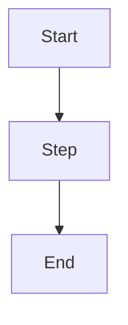

# lecture-to-study-guide Implementation Plan

> **For agentic workers:** REQUIRED SUB-SKILL: Use superpowers:subagent-driven-development (recommended) or superpowers:executing-plans to implement this plan task-by-task. Steps use checkbox (`- [ ]`) syntax for tracking.

**Goal:** Build the `lecture-to-study-guide` skill that converts pasted lecture text, PDF slide decks, or class transcripts into a structured 7-section markdown study guide (TOC, Key Terms, Concept Summaries, Diagrams, Worked Examples, Practice Questions, Cheat Sheet).

**Architecture:** Prompt-heavy Claude skill living at `skills/lecture-to-study-guide/`. Claude's native PDF handling is the default ingestion path per locked marketplace defaults; a minimal `scripts/pdf_extract.py` (pdfplumber) is bundled only for slide-deck edge cases where native handling loses slide boundaries. A `scripts/transcript_clean.py` normalizes VTT/SRT/Otter/Zoom transcripts. References under `references/` hold Cornell/SQ3R/Feynman patterns, question-type mix ratios, term-extraction heuristics, and slide-vs-prose input handling. Per locked V1 defaults, **no cross-skill auto-invocation** — flashcard rows and concept-map diagrams are generated inline via Mermaid/CSV blocks in the study guide itself; a closing suggestion points users at the `flashcards` skill as a V2 follow-up. PDF export reuses `shared/scripts/pdf_render.py` (not built here).

**Tech Stack:** Markdown SKILL.md, Python 3.11+ for bundled scripts (`pdfplumber` for `pdf_extract.py`, stdlib `re` for `transcript_clean.py`), JSON for evals, Mermaid for diagrams, LaTeX math in markdown (`$...$`/`$$...$$`).

---

## File Structure

Files created under `skills/lecture-to-study-guide/`:

- `SKILL.md` — entry point; pushy description with student+teacher triggers; workflow instructions; output-format spec; progressive-disclosure links to `references/`. Target: ≤ 300 lines.
- `scripts/pdf_extract.py` — optional pdfplumber-based slide-deck extractor. CLI: `python pdf_extract.py <input.pdf> [--out <out.txt>]`. Emits plaintext with `--- slide N ---` markers preserving bullet hierarchy.
- `scripts/transcript_clean.py` — VTT/SRT/Otter/Zoom/YouTube plaintext transcript normalizer. CLI: `python transcript_clean.py <input> [--keep-timestamps] [--out <out.txt>]`.
- `scripts/requirements.txt` — pins `pdfplumber>=0.11`.
- `references/study-techniques.md` — Cornell / SQ3R / Feynman patterns applied to study-guide layout.
- `references/term-extraction.md` — heuristics for identifying defined terms (typographic, structural, linguistic cues + decision table).
- `references/question-mix.md` — recall/comprehension/application taxonomy, default ratios by exam format + grade level, question templates.
- `references/input-types.md` — per-input-shape handling (slide-heavy vs prose-heavy vs transcript vs mixed), slide-vs-prose heuristics.
- `references/output-format.md` — exact markdown skeleton for the 7-section guide + cheat-sheet conventions + file-naming rule.
- `evals/evals.json` — 5 test prompts with objective assertions per the spec §9.
- `evals/fixtures/mitosis-lecture.md` — ~1500-word typed lecture fixture for eval 1.
- `evals/fixtures/econ-supply-demand.pdf.md` — markdown simulation of 25-slide PDF (used when PDF fixture isn't feasible in eval harness; real PDF added if available).
- `evals/fixtures/dp-transcript.txt` — 45-min CS dynamic-programming YouTube-style transcript fixture.
- `evals/fixtures/psych-week1.md`, `psych-week2.md`, `psych-week3.md` — 3-lecture intro psych series fixture.
- `evals/fixtures/linalg-eigen.md` — math-heavy grad-level eigenvalues/eigenvectors notes fixture.
- `evals/run_evals.py` — harness that reads `evals.json`, runs assertions against generated markdown files produced by invoking the skill, prints pass/fail.

No shared-script changes. `shared/scripts/pdf_render.py` is referenced by SKILL.md for optional PDF export but is out of scope for this plan.

---

## Task 1: Scaffold skill directory and SKILL.md frontmatter

**Files:**
- Create: `skills/lecture-to-study-guide/SKILL.md`
- Create: `skills/lecture-to-study-guide/scripts/.gitkeep`
- Create: `skills/lecture-to-study-guide/references/.gitkeep`
- Create: `skills/lecture-to-study-guide/evals/.gitkeep`
- Create: `skills/lecture-to-study-guide/evals/fixtures/.gitkeep`

- [ ] **Step 1: Create directory tree**

Run:
```bash
mkdir -p skills/lecture-to-study-guide/{scripts,references,evals/fixtures}
touch skills/lecture-to-study-guide/{scripts,references,evals,evals/fixtures}/.gitkeep
```

- [ ] **Step 2: Write SKILL.md with frontmatter + pushy description stub**

Write `skills/lecture-to-study-guide/SKILL.md` starting with:

```markdown
---
name: lecture-to-study-guide
description: Converts lecture notes, slide-deck PDFs, or class transcripts into a structured study guide with outline, key terms, concept summaries, Mermaid diagrams, worked examples, 10-20 practice questions, and a printable one-page cheat sheet. Fires on student phrasings ("help me study for tomorrow's exam from these notes", "turn my notes into a study guide", "I have a YouTube transcript of my bio lecture — make a review sheet", "cheat sheet from these slides") and teacher phrasings ("make a study guide for my students from this lecture", "build a review handout from my slide deck"). Accepts pasted text, PDF uploads (native Claude PDF handling, falls back to bundled pdf_extract.py for slide-boundary-sensitive decks), VTT/SRT/plaintext transcripts, and multi-lecture series. Calibrates depth to grade level (6-8, 9-12, college default, graduate).
---

# lecture-to-study-guide

(body to be filled in Task 2)
```

- [ ] **Step 3: Verify directory tree**

Run: `ls -la skills/lecture-to-study-guide/`
Expected: `SKILL.md`, `scripts/`, `references/`, `evals/` all present.

- [ ] **Step 4: Commit**

```bash
git add skills/lecture-to-study-guide/
git commit -m "feat(lecture-to-study-guide): scaffold skill directory + SKILL.md frontmatter"
```

---

## Task 2: Write SKILL.md body (workflow + output spec + progressive disclosure)

**Files:**
- Modify: `skills/lecture-to-study-guide/SKILL.md`

- [ ] **Step 1: Append workflow + output body to SKILL.md**

Append below the frontmatter. Keep total file ≤ 300 lines:

```markdown
## When to use this skill

Use when a user provides lecture material (pasted notes, slide-deck PDF, class transcript, or multiple of these) and wants a study-optimized document — not a summary. The output is a structured review guide for exam prep, not a recap of the lecture.

Trigger phrases include:
- "turn my notes into a study guide"
- "make a study guide from these slides"
- "help me study for [exam/test] from these notes"
- "convert this PDF of my [subject] lecture into a study guide"
- "I have a YouTube transcript from class — help me review"
- "build a review sheet from these lectures"
- "make me practice questions from this chapter"
- "cheat sheet for tomorrow's exam from these notes"
- (teacher) "make a study guide for my students from this lecture"
- (teacher) "build a review handout from my slide deck"

## Inputs

Accept any of:
- **Pasted text** — lecture notes, outlines, rough typed notes (messy OK).
- **PDF** — default to Claude's native PDF handling. For slide-deck PDFs where native handling loses slide boundaries or bullet hierarchy, fall back to `scripts/pdf_extract.py` (see references/input-types.md).
- **Transcripts** — VTT/SRT/Otter/Zoom/YouTube-auto-caption plaintext. Normalize with `scripts/transcript_clean.py` to strip timing noise and merge fragmented caption lines.
- **Multi-file** — a series of lectures. Concatenate with `--- Lecture N: <title> ---` markers and produce either one unified guide or a per-lecture set (ask the user once).
- **Mixed** — slide PDF + transcript of the same lecture: slides provide skeleton, transcript provides prose elaboration.

Elicit once if not provided:
- Subject + grade/level (default: college — see calibration table below).
- Exam format if known (MCQ-heavy / essay / problem-set) — biases the practice-question mix.
- Target length (default: proportional to input).

## Workflow

1. **Ingest.** Detect input type. Normalize PDFs and transcripts to plaintext-with-structure-markers (slide boundaries, speaker turns, heading lines).
2. **Detect structure.** Find natural segmentation: markdown/outline headings, slide boundaries, timestamps + topic shifts in transcripts, paragraph breaks. See `references/input-types.md`.
3. **Extract terms.** Use heuristics in `references/term-extraction.md` — typographic signals (bold/italic/"quotes"), structural signals (slide titles, definition blocks), linguistic signals ("X is defined as…", "Y, also known as…"). Build a term → definition → source-location map.
4. **Group topics.** Cluster concepts into 3–8 topic groups. Prefer source-provided groupings (slide sections, chapter headings) over model-imposed ones.
5. **Generate practice questions.** Mix by exam format. Default (no exam-format hint): 40% recall / 35% comprehension / 25% application. See `references/question-mix.md` for templates and ratios.
6. **Assemble** the 7-section markdown guide per `references/output-format.md`. Validate: all sections present, TOC anchors resolve, Mermaid blocks syntactically valid.
7. **Offer** optional PDF export (via `shared/scripts/pdf_render.py`) and a closing suggestion: "Run the `flashcards` skill on this guide next for Anki-ready decks." (V1: no auto-invocation.)

## Output

Single markdown file `study-guide-<topic-slug>-<YYYY-MM-DD>.md` in the user's current working directory. Must contain, in order:

1. **Outline / Table of Contents** — hierarchical, anchor links.
2. **Key Terms + Definitions** — glossary table, columns: Term | Definition | Source (slide #, timestamp, or heading).
3. **Concept Summaries** — one subsection per topic group, 2–5 short paragraphs each.
4. **Diagrams** — Mermaid blocks (flowchart / sequence / mindmap) where content warrants. Generate inline; do NOT call a separate concept-map skill in V1.
5. **Worked Examples** — fully-solved step-by-step examples for quantitative/procedural content. Use LaTeX math (`$...$`, `$$...$$`).
6. **Practice Questions** — 10–20 questions, mixed types. Answers in a single `<details>` block per question (or a trailing answer key section — pick one convention and stick to it per file).
7. **Cheat-Sheet One-Pager** — ~1 printed page, ≤ 500 words for college/grad; may be slightly longer for 6-8 with spatial layout. Most-testable facts, formulas, top 5 terms.

Optional outputs (only when user asks):
- **PDF render** of the full guide via `shared/scripts/pdf_render.py`.
- **Inline flashcard CSV block** — front/back + cloze rows derived from Key Terms + Practice Questions. V1 embeds as a fenced ```csv block within the guide; does NOT call the `flashcards` skill. Suggest `flashcards` skill as a follow-up.

## Grade/level calibration (summary)

| Level | Scaffolding | Question mix (recall/comprehension/application) | Cheat-sheet style |
|---|---|---|---|
| 6-8 | Heavy. Define every term in plain language. Short sentences. Diagrams liberally. | 60/30/10 | Large type, spatial layout |
| 9-12 | Moderate. Define technical terms. | 40/40/20 | Dense but visual |
| College (default) | Terse. Assumes college vocabulary. | 30/40/30 | Information-dense single column |
| Graduate | Terse. Reminder-level summaries. | 20/30/50 | Formula/theorem-dense |

See `references/study-techniques.md` and `references/question-mix.md` for the full rationale.

## Bundled scripts

- `scripts/pdf_extract.py` — **use only when** native Claude PDF handling loses slide boundaries on a slide-deck PDF. CLI: `python scripts/pdf_extract.py <input.pdf> --out <out.txt>`.
- `scripts/transcript_clean.py` — **use always** on VTT/SRT/Otter/Zoom transcripts. CLI: `python scripts/transcript_clean.py <input> [--keep-timestamps] --out <out.txt>`.

Install dependencies on first use: `pip install -r scripts/requirements.txt` (only `pdfplumber`).

## References (loaded on demand)

- `references/study-techniques.md` — Cornell, SQ3R, Feynman patterns; informs cheat-sheet layout and concept-summary structure.
- `references/term-extraction.md` — term-identification heuristics + decision table.
- `references/question-mix.md` — question-type taxonomy, ratios, templates.
- `references/input-types.md` — per-input-shape workflow (slide-heavy vs prose-heavy vs transcript vs mixed); slide-vs-prose heuristic.
- `references/output-format.md` — exact markdown skeleton + conventions.

## Edge cases

- **Very short input (<500 words):** produce a proportionally shorter guide; reduce practice-question count to 5–8. Do not pad.
- **Very long input (>20k words):** warn the user, offer to split; otherwise chunk by section and synthesize a top-level Outline + Cheat Sheet.
- **Slides with no surrounding prose:** elaborate bullets into concept summaries; mark expansions with a brief "(expansion)" note so readers know what came from the slide vs the model.
- **Transcript with no speaker labels:** treat as monologue.
- **Scanned/OCR'd notes:** flag uncertainty; ask user to verify Key Terms before finalizing.
- **Non-English content:** respect source language; generate guide in source language unless translation is requested.
- **Math/science-heavy:** preserve equations in LaTeX. Worked examples show intermediate steps. Prefer Mermaid for conceptual flow; fall back to ASCII / prose description for geometry/waveforms.

## V1 non-goals (V2+)

- Auto-invocation of the `flashcards` or `concept-map` skills. V1 embeds inline equivalents; V2 will delegate.
- Explicit translation flag.
- "Quiz mode" deliverable (questions-only); punt to `quiz-generator`.
```

- [ ] **Step 2: Verify line count and structural sanity**

Run: `wc -l skills/lecture-to-study-guide/SKILL.md`
Expected: ≤ 300 lines.

Run: `grep -c '^## ' skills/lecture-to-study-guide/SKILL.md`
Expected: ≥ 8 top-level sections (When to use, Inputs, Workflow, Output, Calibration, Scripts, References, Edge cases, Non-goals).

- [ ] **Step 3: Commit**

```bash
git add skills/lecture-to-study-guide/SKILL.md
git commit -m "feat(lecture-to-study-guide): write SKILL.md body with triggers, workflow, output spec"
```

---

## Task 3: Write `references/study-techniques.md` (Cornell / SQ3R / Feynman)

**Files:**
- Create: `skills/lecture-to-study-guide/references/study-techniques.md`

- [ ] **Step 1: Draft the file**

Write with these sections and exact content targets:

```markdown
# Study Techniques Reference

Apply these patterns when structuring concept summaries and the cheat-sheet one-pager.

## Cornell Notes layout (applied to cheat sheet)

The Cornell method splits a page into three zones: a narrow left column (cue/keyword column, ~30%), a wider right column (notes, ~60%), and a bottom summary bar (~10%).

For **cheat sheets**:
- Left column: keywords, terms, formula names.
- Right column: one-line definition or the formula itself.
- Bottom: a 2-3 sentence synthesis that ties the page together.

Represent in markdown with a two-column table plus a trailing blockquote:

```markdown
| Cue | Note |
|---|---|
| Eigenvalue | Scalar λ such that Av = λv for some nonzero v |
| Characteristic polynomial | det(A − λI) = 0 |

> **Synthesis:** Eigenvalues are the roots of the characteristic polynomial; their eigenvectors span invariant subspaces and diagonalize A when linearly independent.
```

## SQ3R (Survey, Question, Read, Recite, Review)

SQ3R guides the **concept-summary structure**. For each major topic group, structure the summary so a reader can naturally execute SQ3R:

1. **Survey** — the subsection's H2/H3 heading and a one-sentence "what this section is about."
2. **Question** — an italicized question at the top of the summary that the reader should be able to answer after reading.
3. **Read** — 2–4 paragraphs of prose that answer the question. No jargon without definition.
4. **Recite** — a bold one-line "in your own words" restatement at the end.
5. **Review** — cross-link to the relevant Practice Questions (`[See PQ 3, 7, 12]`).

## Feynman technique (applied to definitions and worked examples)

Feynman: explain a concept as if teaching a novice; any place you stumble is a knowledge gap.

Apply to:
- **Key Terms definitions** — prefer plain-language definitions over textbook verbatim. For grade 6-8, the definition must use no word more advanced than the term itself. For college/grad, precision beats simplicity.
- **Worked examples** — narrate *why* each step happens, not just *what* was done. Every step gets an inline comment.

Example worked-example format:

```markdown
**Problem:** Factor x² − 5x + 6.

1. Identify the form ax² + bx + c with a=1, b=−5, c=6.
   *(Monic quadratic, so we can factor by finding two numbers that multiply to c and add to b.)*
2. Find two numbers whose product is 6 and sum is −5: −2 and −3.
   *(Both negative because product is positive and sum is negative.)*
3. Write as (x − 2)(x − 3).
   *(Verify by FOIL: x² − 3x − 2x + 6 = x² − 5x + 6. ✓)*
```

## When to use which

| Output section | Technique |
|---|---|
| Cheat Sheet | Cornell (two-column + synthesis) |
| Concept Summaries | SQ3R (Question → Read → Recite) |
| Key Terms | Feynman (plain-language definitions) |
| Worked Examples | Feynman (step-narration) |
```

- [ ] **Step 2: Commit**

```bash
git add skills/lecture-to-study-guide/references/study-techniques.md
git commit -m "docs(lecture-to-study-guide): add Cornell/SQ3R/Feynman study-techniques reference"
```

---

## Task 4: Write `references/term-extraction.md`

**Files:**
- Create: `skills/lecture-to-study-guide/references/term-extraction.md`

- [ ] **Step 1: Draft the file**

```markdown
# Term Extraction Heuristics

Use these rules to decide whether a noun phrase in the source belongs in the Key Terms table.

## Signals that a noun phrase IS a term

### Typographic
- Bold (`**X**` or `<b>X</b>`) or italic (`*X*`) in prose notes.
- "Quoted" with definition appositive: *The "basal metabolic rate" is the…*
- ALL CAPS or Title Case in slide bullets (but not whole titles).
- Set off by colon with a following definition clause.

### Structural
- Slide titles or section headings that name a concept (not a question or action).
- Definition blocks: `Term: definition`, `Term — definition`, or a glossary-style list.
- First occurrence of a term that later appears frequently (≥ 3 occurrences).

### Linguistic
- `X is defined as Y`
- `X refers to Y`
- `X, also known as Y,`
- `By X we mean Y`
- `Y, called X,`
- `The term X describes Y`
- Acronyms on first use: `Spaced Repetition System (SRS)`

## Signals that it is NOT a term

- Narrative nouns: "the students", "the lecture", "last week".
- Transitional phrases: "the main point", "the key idea".
- Pronouns and deictics.
- Terms that are defined but never referenced again outside the definition sentence (usually incidental examples).
- Proper nouns that are not domain concepts (a person named to attribute a quote, a city for an example).

## Decision table

| Signal strength | Referenced again? | Include? |
|---|---|---|
| Strong (defined explicitly + typographic) | Yes or No | **Yes** |
| Strong definition, not referenced again | No | Yes — core vocabulary |
| Typographic only, not defined | Yes (≥ 2x) | Yes — infer a definition from context |
| Typographic only, one-shot | No | No |
| No signal, high frequency (≥ 3x) | Yes | Maybe — include if semantically central |
| No signal, low frequency | No | No |

## Output row format

Every term row in the Key Terms table must include:

- **Term** — the canonical form (expand acronyms: `Spaced Repetition System (SRS)`).
- **Definition** — one sentence, Feynman-style (see study-techniques.md). If the source defined it, paraphrase rather than quote verbatim.
- **Source** — where it appeared: `Slide 4`, `03:12`, `Heading: Cell Cycle`, or `Lecture 2, Slide 7` for multi-lecture guides.

## De-duplication (multi-lecture)

When multiple lectures in a series define the same term:
- Keep the first-appearance definition.
- Merge Source cells: `Lecture 1, Slide 3; Lecture 2, Slide 11`.
- If definitions differ meaningfully, retain both in the same row separated by "—also—".

## Minimum and maximum

- Minimum: 5 terms (for inputs < 500 words).
- Target: 8–20 terms for a typical 45-min lecture.
- Maximum: 40 terms. Above this, split into primary-terms and secondary-terms tables.
```

- [ ] **Step 2: Commit**

```bash
git add skills/lecture-to-study-guide/references/term-extraction.md
git commit -m "docs(lecture-to-study-guide): add term-extraction heuristics reference"
```

---

## Task 5: Write `references/question-mix.md`

**Files:**
- Create: `skills/lecture-to-study-guide/references/question-mix.md`

- [ ] **Step 1: Draft the file**

```markdown
# Practice Question Mix

Rules for generating the Practice Questions section (10–20 questions).

## Question-type taxonomy

### Recall (easiest — what is it?)
- "Define X."
- "List the three stages of Y."
- "What is the formula for Z?"
- "Which of the following is the correct definition of A?" (MCQ)
- "True or False: X does Y."

### Comprehension (why / how)
- "Explain in your own words why X happens."
- "Compare A and B."
- "Describe the relationship between X and Y."
- "Give an example of Z (not one used in the lecture)."
- "What would happen if X were removed from the system?"

### Application (solve / predict / apply)
- "Given [new scenario], predict what Y does."
- "Solve for x in the equation…"
- "Apply the Z framework to analyze [case]."
- "Design an experiment that would distinguish between hypothesis A and hypothesis B."
- Multi-step problems with intermediate answers.

## Default mix ratios

| Level / exam-format hint | Recall | Comprehension | Application |
|---|---|---|---|
| 6-8 (default) | 60% | 30% | 10% |
| 9-12 (default) | 40% | 40% | 20% |
| College (default, no hint) | 30% | 40% | 30% |
| Graduate (default) | 20% | 30% | 50% |
| MCQ-heavy exam | +10% recall, −10% application |
| Essay exam | +15% comprehension, −15% recall |
| Problem-set exam | +20% application, −10% recall, −10% comprehension |

Apply grade default first, then adjust by exam-format hint if provided.

## Per-question requirements

Each question must:
1. **Trace to source.** Cite the source section or term (e.g. `— Slide 4 / Term: metaphase`). Place in italics after the question.
2. **Be unambiguous.** A single correct answer (MCQ/short answer) or a clear rubric (essay/explain).
3. **Have an answer.** Every question has an answer in the answer-key (see below).

## Answer-key convention

Use one of these two conventions, consistently per document:

**Convention A — inline `<details>` per question (default):**

```markdown
1. Define metaphase. *(Slide 3 / Term: metaphase)*

   <details><summary>Answer</summary>
   The stage of mitosis in which chromosomes align along the cell's equatorial plane, attached to the spindle apparatus.
   </details>
```

**Convention B — trailing answer-key section:** used when the user requests a printable version, since `<details>` does not render in all PDF renderers.

```markdown
### Practice Questions
1. Define metaphase. *(Slide 3 / Term: metaphase)*
2. ...

### Answer Key
1. The stage of mitosis in which chromosomes align along the cell's equatorial plane…
2. ...
```

Pick Convention A by default. Switch to B if the user asks for PDF export or a printable version.

## Minimum counts

- Inputs < 500 words: 5–8 questions.
- Inputs 500–5000 words: 10–15 questions.
- Inputs > 5000 words or multi-lecture: 15–20 questions.
- Multi-lecture: ≥ 3 questions sourced from each lecture.
```

- [ ] **Step 2: Commit**

```bash
git add skills/lecture-to-study-guide/references/question-mix.md
git commit -m "docs(lecture-to-study-guide): add question-mix taxonomy + ratios reference"
```

---

## Task 6: Write `references/input-types.md` (slide-vs-prose heuristics)

**Files:**
- Create: `skills/lecture-to-study-guide/references/input-types.md`

- [ ] **Step 1: Draft the file**

```markdown
# Input-Type Handling

Per-input-shape workflow. Detect input type first, then branch.

## Detection rules

| Signal | Type |
|---|---|
| File ends in `.pdf` and has consistent page-per-slide layout (≤ 200 words/page, bulleted) | **Slide-deck PDF** |
| File ends in `.pdf` and has multi-paragraph prose pages (≥ 400 words/page) | **Prose PDF** (textbook chapter / handout) |
| File ends in `.vtt`, `.srt`, or plaintext with `HH:MM:SS` timestamps | **Transcript** |
| Pasted text with markdown headings (`#`, `##`) | **Structured prose notes** |
| Pasted text, no headings, paragraph-heavy | **Unstructured prose notes** |
| Multiple files provided | **Multi-lecture series** |
| One PDF + one transcript of same lecture | **Mixed slide+transcript** |

## Slide-heavy PDFs

**Heuristic: IS a slide deck if** all three hold:
1. Average words per page ≤ 200.
2. ≥ 60% of pages contain 3+ bullet-like lines (short lines starting with `•`, `-`, `*`, `>`, or a digit+`.`).
3. Page has a single title-like line at top (≤ 10 words, often bold/large).

**Workflow for slide decks:**
1. Prefer Claude's native PDF handling. If slide boundaries and bullet hierarchy survive (verify by spot-checking: does each page produce a clean title + bullet list?), proceed.
2. If boundaries are lost (e.g. all bullets merged into one paragraph per page, or titles missing), fall back to `scripts/pdf_extract.py`.
3. Treat each slide title as a topic seed.
4. Treat bullets as concept atoms. Elaborate each bullet into 1–2 sentences of prose in the Concept Summaries section. **Mark elaborations** with `(expansion)` at the end of any sentence that goes beyond what the slide literally says.
5. Slide titles become Key Terms candidates IF they name a concept (noun phrase) rather than an action ("Today's Agenda", "Next week").

## Prose-heavy PDFs (textbook chapters)

**Workflow:**
1. Rely entirely on Claude-native PDF handling.
2. Extract structure from existing headings.
3. Group paragraphs into concept clusters by heading.
4. Do NOT run `pdf_extract.py` — it's tuned for slide decks and loses paragraph structure.

## Transcripts

**Always** run `scripts/transcript_clean.py` first. After cleaning:

1. Segment by **topic shifts**, not by timestamp. Topic-shift signals:
   - Keyword set changes (TF-IDF drift).
   - Long pauses (`[pause]`, `...`) or speaker transitions.
   - Verbal cues: "okay so next", "let's move on to", "another thing is".
2. Treat segments as topic groups.
3. When quoting the transcript for Concept Summaries, clean up filler ("um", "uh", "like", "you know"), but preserve technical phrasing.
4. Key Terms: extract via linguistic signals (see term-extraction.md) — typographic signals don't exist in transcripts.
5. Preserve paragraph-level timestamps (every ~2 minutes) in the Source column of the Key Terms table if `--keep-timestamps` was used.

## Structured prose notes

- Use heading hierarchy directly as the topic group structure.
- Extract terms from typographic signals (bold, italic, code backticks).
- Shortest workflow; usually the cleanest input.

## Unstructured prose notes

- **Impose structure by topic-clustering.** Group paragraphs by keyword similarity.
- **Tell the user** that structure was inferred and invite correction: "*I inferred these 4 topic groups. Let me know if you'd prefer a different split.*"
- Reduce scaffolding in output; these notes are often already terse.

## Multi-lecture series

1. Ask once: "Unified guide, per-lecture set, or both?" Default: unified with per-lecture H2 sections inside each of the 7 output sections.
2. Concatenate with `--- Lecture N: <title> ---` markers before processing.
3. De-duplicate Key Terms (see term-extraction.md §De-duplication).
4. Practice Questions: ≥ 3 per lecture.

## Mixed slide+transcript

The common case: user has slides AND a recording transcript of the same lecture.

1. Parse slides first → get skeleton (titles, bullets).
2. Align transcript segments to slides using:
   - Explicit slide-number mentions in transcript ("on slide 4…").
   - Keyword overlap between slide bullets and transcript segment.
   - Default time-based alignment (assume equal time per slide) as last resort.
3. For each slide, use slide title + bullets as the skeleton, and transcript segment as the prose source for the Concept Summary.
4. Source column in Key Terms: `Slide N (transcript HH:MM)`.
```

- [ ] **Step 2: Commit**

```bash
git add skills/lecture-to-study-guide/references/input-types.md
git commit -m "docs(lecture-to-study-guide): add input-types reference with slide-vs-prose heuristics"
```

---

## Task 7: Write `references/output-format.md`

**Files:**
- Create: `skills/lecture-to-study-guide/references/output-format.md`

- [ ] **Step 1: Draft the file**

```markdown
# Output Format Skeleton

Exact markdown skeleton for the generated study guide. Follow this structure in the order below.

## Filename

`study-guide-<topic-slug>-<YYYY-MM-DD>.md` in the user's cwd.

- `<topic-slug>` is `kebab-case-lowercase`, ≤ 40 chars, derived from the primary topic. For multi-lecture: `<course-slug>-weeks-<A>-<B>`.
- `<YYYY-MM-DD>` is today's date in ISO format.

## Document template

```markdown
# Study Guide: <Topic Title>

_Generated <YYYY-MM-DD> from <source description>. Level: <grade level>._

## 1. Outline

- [1. Outline](#1-outline)
- [2. Key Terms](#2-key-terms)
- [3. Concept Summaries](#3-concept-summaries)
  - [3.1 <Topic Group 1>](#31-topic-group-1)
  - ...
- [4. Diagrams](#4-diagrams)
- [5. Worked Examples](#5-worked-examples)
- [6. Practice Questions](#6-practice-questions)
- [7. Cheat Sheet](#7-cheat-sheet)

## 2. Key Terms

| Term | Definition | Source |
|---|---|---|
| ... | ... | ... |

## 3. Concept Summaries

### 3.1 <Topic Group 1>

*Question: <SQ3R-style question this section answers>*

<2–5 short paragraphs.>

**In your own words:** <one-line Recite.>

*See PQ <numbers>.*

### 3.2 <Topic Group 2>
...

## 4. Diagrams



<Brief caption explaining the diagram.>

## 5. Worked Examples

### Example 1: <Title>

**Problem:** <problem statement, LaTeX where needed>

1. <Step 1.>
   *(<why>)*
2. <Step 2.>
   *(<why>)*
...

**Answer:** <final>

## 6. Practice Questions

1. <Question.> *(<source citation>)*

   <details><summary>Answer</summary>
   <answer>
   </details>

2. ...

## 7. Cheat Sheet

| Cue | Note |
|---|---|
| <keyword> | <one-line> |
| ... | ... |

**Top 5 terms:** <term1>, <term2>, <term3>, <term4>, <term5>.

**Key formulas:** $<formula>$, $<formula>$.

> **Synthesis:** <2–3 sentence tie-together.>
```

## Validation checklist before writing the file

- All 7 numbered sections present.
- TOC anchor links resolve (`#N-section-name` form, lowercase, hyphens).
- Key Terms table has ≥ 5 rows (see term-extraction.md for min/target/max).
- At least one Mermaid code block in Diagrams (unless content is fundamentally non-diagrammable — prose literature analysis, poetry — in which case include a short justification: "*No diagrams applicable for this material.*").
- Practice Questions count meets question-mix.md minimums.
- Cheat Sheet ≤ 500 words for college/grad, ≤ 700 words for 6-8/9-12.
- All LaTeX math uses `$...$` (inline) or `$$...$$` (block), never unicode substitution for operators.

## Flashcard CSV inline block (opt-in)

If the user asks for flashcards inline (V1 does not auto-invoke the flashcards skill):

```csv
front,back,type
"Define metaphase","Stage of mitosis where chromosomes align at the equatorial plane","front-back"
"{{c1::Metaphase}} is the stage where chromosomes align at the equator","","cloze"
```

End the guide with a single suggestion line:
`> For Anki/Quizlet export, run the flashcards skill on this file next.`
```

- [ ] **Step 2: Commit**

```bash
git add skills/lecture-to-study-guide/references/output-format.md
git commit -m "docs(lecture-to-study-guide): add output-format skeleton reference"
```

---

## Task 8: Write `scripts/transcript_clean.py` + tests

**Files:**
- Create: `skills/lecture-to-study-guide/scripts/transcript_clean.py`
- Create: `skills/lecture-to-study-guide/scripts/requirements.txt`
- Create: `skills/lecture-to-study-guide/scripts/test_transcript_clean.py`

- [ ] **Step 1: Write failing tests**

Write `skills/lecture-to-study-guide/scripts/test_transcript_clean.py`:

```python
"""Tests for transcript_clean.py."""
import subprocess
import textwrap
from pathlib import Path

SCRIPT = Path(__file__).parent / "transcript_clean.py"


def run(stdin: str, *args: str) -> str:
    result = subprocess.run(
        ["python", str(SCRIPT), "-", *args],
        input=stdin,
        capture_output=True,
        text=True,
        check=True,
    )
    return result.stdout


def test_strips_vtt_headers_and_timestamps():
    vtt = textwrap.dedent("""\
        WEBVTT

        00:00:01.000 --> 00:00:03.500
        Hello and welcome to today's lecture.

        00:00:03.500 --> 00:00:07.200
        We are going to talk about dynamic programming.
        """)
    out = run(vtt)
    assert "WEBVTT" not in out
    assert "-->" not in out
    assert "00:00:01" not in out
    assert "Hello and welcome to today's lecture." in out
    assert "dynamic programming" in out


def test_strips_srt_sequence_numbers_and_timestamps():
    srt = textwrap.dedent("""\
        1
        00:00:01,000 --> 00:00:03,500
        First sentence here.

        2
        00:00:03,500 --> 00:00:07,200
        Second sentence follows.
        """)
    out = run(srt)
    assert "00:00:01,000" not in out
    assert "First sentence here." in out
    assert "Second sentence follows." in out
    # sequence numbers should not appear as standalone lines
    assert "\n1\n" not in "\n" + out + "\n"


def test_strips_otter_speaker_timestamps():
    otter = "Speaker 1 00:04:23\nThis is a sentence.\n\nSpeaker 2 00:04:45\nAnother one."
    out = run(otter)
    assert "00:04:23" not in out
    assert "00:04:45" not in out
    assert "This is a sentence." in out
    assert "Another one." in out


def test_keeps_speaker_labels_when_present():
    text = "Alice: Hello.\nBob: Hi there.\n"
    out = run(text)
    assert "Alice:" in out
    assert "Bob:" in out


def test_merges_fragmented_caption_lines_into_sentences():
    fragmented = textwrap.dedent("""\
        00:00:01.000 --> 00:00:02.000
        we are going to

        00:00:02.000 --> 00:00:03.000
        talk about dynamic

        00:00:03.000 --> 00:00:04.000
        programming today.
        """)
    out = run(fragmented)
    # Should become a single sentence or at least a single paragraph
    assert "we are going to talk about dynamic programming today." in out.replace("\n", " ")


def test_keep_timestamps_flag_preserves_coarse_markers():
    vtt = textwrap.dedent("""\
        WEBVTT

        00:00:01.000 --> 00:00:03.500
        First segment.

        00:02:05.000 --> 00:02:07.000
        Second segment after two minutes.
        """)
    out = run(vtt, "--keep-timestamps")
    # Should retain at least one coarse HH:MM marker
    assert "00:00" in out or "00:02" in out


if __name__ == "__main__":
    import sys
    import pytest
    sys.exit(pytest.main([__file__, "-v"]))
```

- [ ] **Step 2: Run tests to verify they fail**

Run: `python -m pytest skills/lecture-to-study-guide/scripts/test_transcript_clean.py -v`
Expected: FAIL — `transcript_clean.py` does not exist yet.

- [ ] **Step 3: Write `scripts/requirements.txt`**

```
pdfplumber>=0.11.0
```

- [ ] **Step 4: Implement `scripts/transcript_clean.py`**

```python
#!/usr/bin/env python3
"""Normalize lecture transcripts (VTT/SRT/Otter/Zoom/plaintext).

Strips timing noise, merges fragmented auto-caption lines, preserves speaker
labels when present. Optionally retains coarse (paragraph-boundary) timestamps
for cross-reference.

Usage:
    python transcript_clean.py <input|-> [--keep-timestamps] [--out <path>]

    Use '-' as input to read from stdin.
"""
from __future__ import annotations

import argparse
import re
import sys
from pathlib import Path

# Matches VTT/SRT timestamp ranges: 00:00:01.000 --> 00:00:03.500 (VTT uses ., SRT uses ,)
RE_TIMESTAMP_RANGE = re.compile(
    r"^\s*\d{1,2}:\d{2}:\d{2}[.,]\d{3}\s*-->\s*\d{1,2}:\d{2}:\d{2}[.,]\d{3}.*$",
    re.MULTILINE,
)
# Matches Otter/Zoom "Speaker N 00:04:23" style
RE_SPEAKER_TIMESTAMP = re.compile(
    r"^(Speaker\s+\d+|[A-Z][a-zA-Z .'-]{0,40})\s+(\d{1,2}:\d{2}(?::\d{2})?(?:[.,]\d{1,3})?)\s*$",
    re.MULTILINE,
)
# Matches bare HH:MM:SS or HH:MM timestamp lines
RE_BARE_TIMESTAMP = re.compile(
    r"^\s*\d{1,2}:\d{2}(?::\d{2})?(?:[.,]\d{1,3})?\s*$",
    re.MULTILINE,
)
# Matches SRT standalone sequence numbers (line containing only digits)
RE_SRT_SEQ = re.compile(r"^\s*\d{1,5}\s*$", re.MULTILINE)
# Matches VTT header
RE_VTT_HEADER = re.compile(r"^WEBVTT.*?(?:\n\s*\n|\Z)", re.DOTALL | re.MULTILINE)
# Matches VTT NOTE blocks
RE_VTT_NOTE = re.compile(r"^NOTE\s.*?(?:\n\s*\n|\Z)", re.DOTALL | re.MULTILINE)
# Sentence-end punctuation
SENTENCE_END = re.compile(r"[.!?][\"')\]]*\s*$")


def strip_vtt_srt_noise(text: str) -> str:
    text = RE_VTT_HEADER.sub("", text)
    text = RE_VTT_NOTE.sub("", text)
    text = RE_TIMESTAMP_RANGE.sub("", text)
    text = RE_SRT_SEQ.sub("", text)
    return text


def strip_otter_zoom_speaker_timestamps(text: str) -> str:
    def repl(m: re.Match) -> str:
        speaker = m.group(1)
        # Drop generic "Speaker N" labels; keep named speakers
        if re.match(r"^Speaker\s+\d+$", speaker):
            return ""
        return f"{speaker}:"
    return RE_SPEAKER_TIMESTAMP.sub(repl, text)


def strip_bare_timestamps(text: str) -> str:
    return RE_BARE_TIMESTAMP.sub("", text)


def merge_fragmented_lines(text: str) -> str:
    """Merge consecutive short lines into sentences, preserving paragraph breaks."""
    # Split on blank lines into paragraphs; within each paragraph, merge lines
    # separated by single newlines into spaces unless the line ends with sentence
    # punctuation.
    paragraphs = re.split(r"\n\s*\n+", text)
    merged_paragraphs = []
    for para in paragraphs:
        lines = [ln.strip() for ln in para.splitlines() if ln.strip()]
        if not lines:
            continue
        out_lines: list[str] = []
        buffer = ""
        for ln in lines:
            # If it looks like a speaker label "Name:" keep as its own line break
            if re.match(r"^[A-Z][a-zA-Z .'-]{0,40}:", ln):
                if buffer:
                    out_lines.append(buffer)
                    buffer = ""
                out_lines.append(ln)
                continue
            if buffer and not SENTENCE_END.search(buffer):
                buffer = buffer + " " + ln
            else:
                if buffer:
                    out_lines.append(buffer)
                buffer = ln
        if buffer:
            out_lines.append(buffer)
        merged_paragraphs.append("\n".join(out_lines))
    return "\n\n".join(merged_paragraphs)


def insert_coarse_timestamp_markers(original: str, cleaned: str) -> str:
    """Find timestamps at ~2-min intervals in the original and insert markers
    at corresponding paragraph boundaries in the cleaned text."""
    # Find first timestamp per chunk of ~2 min
    ts_matches = re.findall(
        r"(\d{1,2}):(\d{2}):\d{2}[.,]\d{3}\s*-->", original
    )
    if not ts_matches:
        return cleaned
    markers: list[str] = []
    last_bucket = -1
    for hh, mm in ts_matches:
        total = int(hh) * 60 + int(mm)
        bucket = total // 2
        if bucket != last_bucket:
            markers.append(f"[{hh}:{mm}]")
            last_bucket = bucket
    # Insert markers at paragraph boundaries, proportionally
    paragraphs = cleaned.split("\n\n")
    if not paragraphs:
        return cleaned
    step = max(1, len(paragraphs) // max(1, len(markers)))
    for i, marker in enumerate(markers):
        idx = min(i * step, len(paragraphs) - 1)
        paragraphs[idx] = f"{marker} {paragraphs[idx]}"
    return "\n\n".join(paragraphs)


def clean_transcript(text: str, keep_timestamps: bool = False) -> str:
    original = text
    text = strip_vtt_srt_noise(text)
    text = strip_otter_zoom_speaker_timestamps(text)
    text = strip_bare_timestamps(text)
    text = merge_fragmented_lines(text)
    # Collapse runs of blank lines
    text = re.sub(r"\n{3,}", "\n\n", text).strip()
    if keep_timestamps:
        text = insert_coarse_timestamp_markers(original, text)
    return text + "\n"


def main() -> int:
    ap = argparse.ArgumentParser(description=__doc__)
    ap.add_argument("input", help="Input file path, or '-' for stdin")
    ap.add_argument("--keep-timestamps", action="store_true",
                    help="Insert coarse (~2-min) timestamp markers at paragraph boundaries")
    ap.add_argument("--out", help="Output file path (default: stdout)")
    args = ap.parse_args()

    if args.input == "-":
        raw = sys.stdin.read()
    else:
        raw = Path(args.input).read_text(encoding="utf-8")

    cleaned = clean_transcript(raw, keep_timestamps=args.keep_timestamps)

    if args.out:
        Path(args.out).write_text(cleaned, encoding="utf-8")
    else:
        sys.stdout.write(cleaned)
    return 0


if __name__ == "__main__":
    sys.exit(main())
```

- [ ] **Step 5: Run tests to verify pass**

Run:
```bash
pip install pytest
python -m pytest skills/lecture-to-study-guide/scripts/test_transcript_clean.py -v
```
Expected: all 6 tests pass.

- [ ] **Step 6: Commit**

```bash
git add skills/lecture-to-study-guide/scripts/transcript_clean.py \
        skills/lecture-to-study-guide/scripts/test_transcript_clean.py \
        skills/lecture-to-study-guide/scripts/requirements.txt
git commit -m "feat(lecture-to-study-guide): add transcript_clean.py for VTT/SRT/Otter normalization"
```

---

## Task 9: Write `scripts/pdf_extract.py` + tests

**Files:**
- Create: `skills/lecture-to-study-guide/scripts/pdf_extract.py`
- Create: `skills/lecture-to-study-guide/scripts/test_pdf_extract.py`
- Create: `skills/lecture-to-study-guide/scripts/test_fixtures/make_slide_pdf.py`

- [ ] **Step 1: Write failing tests**

Write `skills/lecture-to-study-guide/scripts/test_pdf_extract.py`:

```python
"""Tests for pdf_extract.py — slide-deck PDF extractor."""
import subprocess
import sys
from pathlib import Path

import pytest

SCRIPT = Path(__file__).parent / "pdf_extract.py"
FIXTURE_MAKER = Path(__file__).parent / "test_fixtures" / "make_slide_pdf.py"


@pytest.fixture(scope="module")
def slide_pdf(tmp_path_factory):
    out = tmp_path_factory.mktemp("pdf") / "slides.pdf"
    subprocess.run(
        [sys.executable, str(FIXTURE_MAKER), str(out)],
        check=True,
    )
    return out


def run(pdf_path: Path, *args: str) -> str:
    result = subprocess.run(
        [sys.executable, str(SCRIPT), str(pdf_path), *args],
        capture_output=True,
        text=True,
        check=True,
    )
    return result.stdout


def test_emits_slide_markers(slide_pdf):
    out = run(slide_pdf)
    assert "--- slide 1 ---" in out
    assert "--- slide 2 ---" in out
    assert "--- slide 3 ---" in out


def test_preserves_slide_titles(slide_pdf):
    out = run(slide_pdf)
    assert "Introduction" in out
    assert "Supply and Demand" in out
    assert "Equilibrium" in out


def test_preserves_bullet_hierarchy(slide_pdf):
    out = run(slide_pdf)
    # Top-level bullets
    assert "- Definition of market" in out or "• Definition of market" in out
    # Sub-bullets (indented)
    assert "  - Buyers" in out or "\t- Buyers" in out or "  • Buyers" in out


def test_slide_count_matches(slide_pdf):
    out = run(slide_pdf)
    assert out.count("--- slide ") == 3


def test_out_flag_writes_to_file(slide_pdf, tmp_path):
    out_file = tmp_path / "extracted.txt"
    run(slide_pdf, "--out", str(out_file))
    assert out_file.exists()
    assert "--- slide 1 ---" in out_file.read_text()
```

Write `skills/lecture-to-study-guide/scripts/test_fixtures/make_slide_pdf.py` (bundled fixture generator, used in tests, not shipped to users):

```python
"""Generate a 3-slide test PDF using reportlab (test-only dependency)."""
from __future__ import annotations

import sys
from pathlib import Path

from reportlab.lib.pagesizes import letter
from reportlab.pdfgen import canvas


SLIDES = [
    ("Introduction", [("- Definition of market", 0), ("- Buyers", 1), ("- Sellers", 1)]),
    ("Supply and Demand", [("- Law of supply", 0), ("- Law of demand", 0), ("- Price signals", 0)]),
    ("Equilibrium", [("- Market clears", 0), ("- Quantity supplied = quantity demanded", 1)]),
]


def build(out: Path) -> None:
    c = canvas.Canvas(str(out), pagesize=letter)
    width, height = letter
    for title, bullets in SLIDES:
        # Title
        c.setFont("Helvetica-Bold", 24)
        c.drawString(72, height - 100, title)
        # Bullets
        c.setFont("Helvetica", 14)
        y = height - 160
        for text, indent in bullets:
            c.drawString(72 + indent * 30, y, text)
            y -= 24
        c.showPage()
    c.save()


if __name__ == "__main__":
    build(Path(sys.argv[1]))
```

- [ ] **Step 2: Install test-only deps and run tests to verify fail**

Run:
```bash
pip install pdfplumber reportlab pytest
python -m pytest skills/lecture-to-study-guide/scripts/test_pdf_extract.py -v
```
Expected: FAIL — `pdf_extract.py` does not exist yet.

- [ ] **Step 3: Implement `scripts/pdf_extract.py`**

```python
#!/usr/bin/env python3
"""Extract slide-deck PDFs to plaintext with slide markers and bullet hierarchy.

Use ONLY when Claude's native PDF handling loses slide boundaries. For prose
PDFs (textbook chapters), rely on native handling instead.

Usage:
    python pdf_extract.py <input.pdf> [--out <path>]
"""
from __future__ import annotations

import argparse
import sys
from pathlib import Path

import pdfplumber


BULLET_CHARS = ("•", "·", "-", "*", "◦", "▪", "▫", "►")


def _is_bullet_line(text: str) -> bool:
    stripped = text.lstrip()
    return (
        any(stripped.startswith(ch) for ch in BULLET_CHARS)
        or (len(stripped) >= 2 and stripped[0].isdigit() and stripped[1] in ".)")
    )


def _indent_level(x0: float, base_x: float, step: float = 25.0) -> int:
    """Quantize x-position to an indent level (0, 1, 2, …)."""
    delta = max(0.0, x0 - base_x)
    return int(delta / step)


def extract_slide(page, slide_num: int) -> str:
    """Extract a single page as a slide: title + indented bullet tree."""
    words = page.extract_words(keep_blank_chars=False, use_text_flow=True) or []
    if not words:
        return f"--- slide {slide_num} ---\n"

    # Group words into lines by y-position.
    lines: dict[int, list[dict]] = {}
    for w in words:
        y_key = round(w["top"])
        lines.setdefault(y_key, []).append(w)

    sorted_ys = sorted(lines.keys())
    line_records = []
    for y in sorted_ys:
        ws = sorted(lines[y], key=lambda w: w["x0"])
        text = " ".join(w["text"] for w in ws)
        x0 = min(w["x0"] for w in ws)
        size = max(float(w.get("size", 12.0)) for w in ws) if ws else 12.0
        line_records.append({"y": y, "text": text, "x0": x0, "size": size})

    if not line_records:
        return f"--- slide {slide_num} ---\n"

    # Title: the topmost line with the largest font size (ties → topmost).
    max_size = max(r["size"] for r in line_records)
    title_record = next(r for r in line_records if r["size"] == max_size)
    title = title_record["text"]

    body = [r for r in line_records if r is not title_record]

    # Base x = min x0 among body lines
    base_x = min((r["x0"] for r in body), default=title_record["x0"])

    out_lines = [f"--- slide {slide_num} ---", title, ""]
    for r in body:
        level = _indent_level(r["x0"], base_x)
        indent = "  " * level
        text = r["text"]
        if not _is_bullet_line(text):
            # Add a bullet prefix so hierarchy is obvious in plaintext
            text = f"- {text}"
        out_lines.append(f"{indent}{text}")
    out_lines.append("")
    return "\n".join(out_lines) + "\n"


def extract_pdf(pdf_path: Path) -> str:
    chunks = []
    with pdfplumber.open(pdf_path) as pdf:
        for i, page in enumerate(pdf.pages, start=1):
            chunks.append(extract_slide(page, i))
    return "\n".join(chunks)


def main() -> int:
    ap = argparse.ArgumentParser(description=__doc__)
    ap.add_argument("input", help="Input PDF path")
    ap.add_argument("--out", help="Output path (default: stdout)")
    args = ap.parse_args()

    text = extract_pdf(Path(args.input))

    if args.out:
        Path(args.out).write_text(text, encoding="utf-8")
    else:
        sys.stdout.write(text)
    return 0


if __name__ == "__main__":
    sys.exit(main())
```

- [ ] **Step 4: Run tests to verify pass**

Run: `python -m pytest skills/lecture-to-study-guide/scripts/test_pdf_extract.py -v`
Expected: all 5 tests pass.

- [ ] **Step 5: Commit**

```bash
git add skills/lecture-to-study-guide/scripts/pdf_extract.py \
        skills/lecture-to-study-guide/scripts/test_pdf_extract.py \
        skills/lecture-to-study-guide/scripts/test_fixtures/
git commit -m "feat(lecture-to-study-guide): add pdf_extract.py for slide-deck PDFs"
```

---

## Task 10: Create eval fixtures

**Files:**
- Create: `skills/lecture-to-study-guide/evals/fixtures/mitosis-lecture.md`
- Create: `skills/lecture-to-study-guide/evals/fixtures/econ-supply-demand.md` (markdown simulation of slide deck; real PDF bundled later if available)
- Create: `skills/lecture-to-study-guide/evals/fixtures/dp-transcript.txt`
- Create: `skills/lecture-to-study-guide/evals/fixtures/psych-week1.md`
- Create: `skills/lecture-to-study-guide/evals/fixtures/psych-week2.md`
- Create: `skills/lecture-to-study-guide/evals/fixtures/psych-week3.md`
- Create: `skills/lecture-to-study-guide/evals/fixtures/linalg-eigen.md`

- [ ] **Step 1: Write mitosis-lecture.md (~1500 words, 9-12 grade)**

Must include (so eval assertions pass):
- Define each of: prophase, metaphase, anaphase, telophase, cytokinesis, chromatid, centromere, spindle.
- Enough prose to produce ≥ 10 practice questions.

Write the fixture as a realistic typed student-note-style lecture on mitosis with H2 headings for each phase. Keep it between 1400 and 1700 words. Use bold for key terms.

- [ ] **Step 2: Write econ-supply-demand.md (simulated slide deck, 25 slides)**

Format with `## Slide N: <Title>` headings, 3–6 bullets per slide. Cover: market definition, law of supply, law of demand, shifts, equilibrium price, surplus, shortage, elasticity, price ceilings, price floors, taxes, subsidies, numeric worked example (find equilibrium P, Q from Qd = 100 − 2P, Qs = 20 + 2P).

- [ ] **Step 3: Write dp-transcript.txt (plaintext CS lecture transcript, ~3000 words, no speaker labels)**

Dynamic-programming 45-min lecture transcript with timestamps (`HH:MM:SS`). Covers: memoization, tabulation, Fibonacci, longest common subsequence (with worked example), 0/1 knapsack (with worked example). Include realistic filler words ("um", "so", "you know") and caption-style line breaks — the cleaner will handle these.

- [ ] **Step 4: Write psych-week1/2/3.md (3 intro-psych lectures)**

- Week 1: History of psychology, major schools (structuralism, functionalism, behaviorism, cognitive, humanistic). ≥ 3 terms.
- Week 2: Research methods (experiments, correlation, case studies, surveys). ≥ 3 terms.
- Week 3: Biological bases (neurons, synapse, neurotransmitters, CNS/PNS). ≥ 3 terms.
- Each file uses markdown headings and bold for key terms.

- [ ] **Step 5: Write linalg-eigen.md (grad-level notes, math-heavy)**

Includes LaTeX math blocks for: Av = λv, det(A − λI) = 0, at least one worked 2×2 example with full step-by-step derivation, diagonalization, and the spectral theorem for symmetric matrices. Bold or define: eigenvalue, eigenvector, characteristic polynomial, eigenspace, diagonalizable, spectral theorem, algebraic multiplicity, geometric multiplicity.

- [ ] **Step 6: Sanity-check fixture sizes**

Run:
```bash
wc -w skills/lecture-to-study-guide/evals/fixtures/*.md skills/lecture-to-study-guide/evals/fixtures/*.txt
```
Expected:
- `mitosis-lecture.md`: 1400–1700 words.
- `econ-supply-demand.md`: 500–1200 words (slide-style, terse).
- `dp-transcript.txt`: 2500–3500 words.
- each psych file: 400–900 words.
- `linalg-eigen.md`: 800–1500 words.

- [ ] **Step 7: Commit**

```bash
git add skills/lecture-to-study-guide/evals/fixtures/
git commit -m "test(lecture-to-study-guide): add 5 eval fixtures (mitosis, econ, DP transcript, psych series, linalg)"
```

---

## Task 11: Write `evals/evals.json`

**Files:**
- Create: `skills/lecture-to-study-guide/evals/evals.json`

- [ ] **Step 1: Write evals.json**

```json
{
  "skill": "lecture-to-study-guide",
  "evals": [
    {
      "id": "mitosis-prose-9to12",
      "prompt": "Please turn my lecture notes into a study guide. I'm in 10th-grade biology and have an exam on cell division. Notes are in evals/fixtures/mitosis-lecture.md.",
      "input_fixture": "fixtures/mitosis-lecture.md",
      "expected_output_pattern": "study-guide-*.md",
      "assertions": [
        {"type": "section_present", "names": ["Outline", "Key Terms", "Concept Summaries", "Diagrams", "Worked Examples", "Practice Questions", "Cheat Sheet"]},
        {"type": "term_count_gte", "value": 8},
        {"type": "terms_include_all", "terms": ["prophase", "metaphase", "anaphase", "telophase", "cytokinesis", "chromatid", "centromere", "spindle"]},
        {"type": "practice_question_count_gte", "value": 10},
        {"type": "mermaid_block_count_gte", "value": 1},
        {"type": "cheat_sheet_word_count_lte", "value": 700}
      ]
    },
    {
      "id": "econ-slide-deck-college",
      "prompt": "Here are my econ lecture slides on supply and demand. Make me a study guide for the midterm. I'm in intro microeconomics, college level.",
      "input_fixture": "fixtures/econ-supply-demand.md",
      "expected_output_pattern": "study-guide-*.md",
      "assertions": [
        {"type": "section_present", "names": ["Outline", "Key Terms", "Concept Summaries", "Diagrams", "Worked Examples", "Practice Questions", "Cheat Sheet"]},
        {"type": "toc_matches_source_headings_pct_gte", "value": 80, "source": "fixtures/econ-supply-demand.md"},
        {"type": "term_count_gte", "value": 10},
        {"type": "worked_example_count_gte", "value": 1},
        {"type": "worked_example_contains_numeric_solution", "value": true},
        {"type": "application_question_count_gte", "value": 2}
      ]
    },
    {
      "id": "dp-transcript-college",
      "prompt": "I have a transcript from my CS lecture on dynamic programming. Clean it up and make me a study guide — I need to review for tomorrow.",
      "input_fixture": "fixtures/dp-transcript.txt",
      "preprocess": "python scripts/transcript_clean.py fixtures/dp-transcript.txt --out fixtures/dp-transcript.cleaned.txt",
      "expected_output_pattern": "study-guide-*.md",
      "assertions": [
        {"type": "section_present", "names": ["Outline", "Key Terms", "Concept Summaries", "Diagrams", "Worked Examples", "Practice Questions", "Cheat Sheet"]},
        {"type": "worked_example_count_gte", "value": 2},
        {"type": "practice_question_count_gte", "value": 12},
        {"type": "no_timestamp_noise_in_prose", "value": true}
      ]
    },
    {
      "id": "multi-lecture-psych",
      "prompt": "Here are my intro-psych lecture notes from weeks 1, 2, and 3. Combine them into one study guide for the first exam. College level.",
      "input_fixture": ["fixtures/psych-week1.md", "fixtures/psych-week2.md", "fixtures/psych-week3.md"],
      "expected_output_pattern": "study-guide-*.md",
      "assertions": [
        {"type": "toc_contains_topics_from_all_sources", "value": true},
        {"type": "key_terms_deduplicated", "value": true},
        {"type": "practice_questions_per_source_gte", "value": 3}
      ]
    },
    {
      "id": "linalg-eigen-grad",
      "prompt": "Here are my linear algebra notes on eigenvalues and eigenvectors. I'm in a graduate-level class — make me a dense study guide.",
      "input_fixture": "fixtures/linalg-eigen.md",
      "expected_output_pattern": "study-guide-*.md",
      "assertions": [
        {"type": "worked_example_includes_step_by_step_derivation", "value": true},
        {"type": "latex_math_used", "value": true},
        {"type": "cheat_sheet_formula_count_gte", "value": 3},
        {"type": "application_question_pct_gte", "value": 40}
      ]
    }
  ]
}
```

- [ ] **Step 2: Validate JSON**

Run: `python -c "import json; json.load(open('skills/lecture-to-study-guide/evals/evals.json'))"`
Expected: no output, exit 0.

- [ ] **Step 3: Commit**

```bash
git add skills/lecture-to-study-guide/evals/evals.json
git commit -m "test(lecture-to-study-guide): add evals.json with 5 prompts + assertions"
```

---

## Task 12: Write `evals/run_evals.py` harness

**Files:**
- Create: `skills/lecture-to-study-guide/evals/run_evals.py`

- [ ] **Step 1: Implement the harness**

The harness is a pure assertion runner over pre-generated study-guide markdown files. Skill invocation happens out-of-band (driven by the parent subagent-driven-development loop or by a human pasting fixtures into Claude). The harness expects a directory of generated guides and maps them to eval IDs via a `--generated-dir` flag.

```python
#!/usr/bin/env python3
"""Run assertions from evals.json against generated study guides.

Usage:
    python run_evals.py --generated-dir <path>

The generated directory should contain one markdown file per eval, named
`<eval_id>.md` (e.g. mitosis-prose-9to12.md).
"""
from __future__ import annotations

import argparse
import json
import re
import sys
from dataclasses import dataclass
from pathlib import Path


EVALS_DIR = Path(__file__).parent


@dataclass
class AssertionResult:
    eval_id: str
    name: str
    ok: bool
    detail: str = ""


# --- Section parsing helpers ---

SECTION_NAMES = ["Outline", "Key Terms", "Concept Summaries", "Diagrams",
                 "Worked Examples", "Practice Questions", "Cheat Sheet"]


def extract_sections(md: str) -> dict[str, str]:
    """Split markdown into sections by numbered H2 headings like '## 2. Key Terms'."""
    sections: dict[str, str] = {}
    pattern = re.compile(r"^##\s+\d+\.\s+(.+?)\s*$", re.MULTILINE)
    matches = list(pattern.finditer(md))
    for i, m in enumerate(matches):
        name = m.group(1).strip()
        start = m.end()
        end = matches[i + 1].start() if i + 1 < len(matches) else len(md)
        sections[name] = md[start:end].strip()
    return sections


def count_key_terms(section_text: str) -> int:
    # Rows in a markdown table (skip header + separator rows)
    rows = [l for l in section_text.splitlines() if l.strip().startswith("|")]
    # Subtract header and separator
    return max(0, len(rows) - 2)


def extract_terms(section_text: str) -> list[str]:
    terms = []
    for line in section_text.splitlines():
        line = line.strip()
        if not line.startswith("|") or line.startswith("|---") or "Term" in line.split("|")[1:2]:
            continue
        cells = [c.strip() for c in line.strip("|").split("|")]
        if cells:
            terms.append(cells[0].lower())
    return terms


def count_practice_questions(section_text: str) -> int:
    return len(re.findall(r"^\s*\d+\.\s+", section_text, re.MULTILINE))


def count_mermaid_blocks(md: str) -> int:
    return len(re.findall(r"```mermaid\b", md))


def count_worked_examples(section_text: str) -> int:
    return len(re.findall(r"^###\s+Example\s+\d+", section_text, re.MULTILINE))


def word_count(text: str) -> int:
    return len(re.findall(r"\S+", text))


def has_numeric_solution(section_text: str) -> bool:
    # Any line ending with a number after "Answer:" or "= <number>"
    return bool(re.search(r"Answer:\s*.*?\d", section_text) or re.search(r"=\s*\d+(?:\.\d+)?", section_text))


def has_timestamp_noise(md: str) -> bool:
    # Rough: HH:MM:SS inside prose sections (not inside code or table cells)
    prose_sections = ["Concept Summaries", "Worked Examples", "Cheat Sheet"]
    sections = extract_sections(md)
    for name in prose_sections:
        text = sections.get(name, "")
        # Strip code blocks
        text = re.sub(r"```.*?```", "", text, flags=re.DOTALL)
        if re.search(r"\b\d{1,2}:\d{2}:\d{2}\b", text):
            return True
    return False


def classify_question(q_text: str) -> str:
    q = q_text.lower()
    application_triggers = ["solve", "predict", "apply", "design", "calculate", "compute", "given", "if ", "suppose"]
    comprehension_triggers = ["explain", "compare", "describe", "why", "how does", "relationship"]
    if any(t in q for t in application_triggers):
        return "application"
    if any(t in q for t in comprehension_triggers):
        return "comprehension"
    return "recall"


def extract_questions(section_text: str) -> list[str]:
    return [m.group(1).strip()
            for m in re.finditer(r"^\s*\d+\.\s+(.+?)(?=\n\s*\n|\n\s*\d+\.\s|$)", section_text, re.DOTALL | re.MULTILINE)]


def extract_formulas(section_text: str) -> list[str]:
    return re.findall(r"\$[^$\n]+\$", section_text) + re.findall(r"\$\$[^$]+\$\$", section_text, re.DOTALL)


# --- Assertion dispatch ---

def check(md: str, a: dict, eval_id: str) -> AssertionResult:
    t = a["type"]
    sections = extract_sections(md)

    if t == "section_present":
        missing = [n for n in a["names"] if n not in sections]
        return AssertionResult(eval_id, t, not missing, f"missing={missing}")

    if t == "term_count_gte":
        n = count_key_terms(sections.get("Key Terms", ""))
        return AssertionResult(eval_id, t, n >= a["value"], f"got={n} want>={a['value']}")

    if t == "terms_include_all":
        got_terms = " ".join(extract_terms(sections.get("Key Terms", ""))).lower()
        missing = [tm for tm in a["terms"] if tm.lower() not in got_terms]
        return AssertionResult(eval_id, t, not missing, f"missing={missing}")

    if t == "practice_question_count_gte":
        n = count_practice_questions(sections.get("Practice Questions", ""))
        return AssertionResult(eval_id, t, n >= a["value"], f"got={n} want>={a['value']}")

    if t == "mermaid_block_count_gte":
        n = count_mermaid_blocks(md)
        return AssertionResult(eval_id, t, n >= a["value"], f"got={n}")

    if t == "cheat_sheet_word_count_lte":
        n = word_count(sections.get("Cheat Sheet", ""))
        return AssertionResult(eval_id, t, n <= a["value"], f"got={n} want<={a['value']}")

    if t == "worked_example_count_gte":
        n = count_worked_examples(sections.get("Worked Examples", ""))
        return AssertionResult(eval_id, t, n >= a["value"], f"got={n}")

    if t == "worked_example_contains_numeric_solution":
        ok = has_numeric_solution(sections.get("Worked Examples", ""))
        return AssertionResult(eval_id, t, ok == a["value"], "")

    if t == "application_question_count_gte":
        qs = extract_questions(sections.get("Practice Questions", ""))
        n = sum(1 for q in qs if classify_question(q) == "application")
        return AssertionResult(eval_id, t, n >= a["value"], f"got={n}")

    if t == "application_question_pct_gte":
        qs = extract_questions(sections.get("Practice Questions", ""))
        if not qs:
            return AssertionResult(eval_id, t, False, "no questions")
        pct = 100 * sum(1 for q in qs if classify_question(q) == "application") / len(qs)
        return AssertionResult(eval_id, t, pct >= a["value"], f"got={pct:.0f}% want>={a['value']}%")

    if t == "no_timestamp_noise_in_prose":
        ok = not has_timestamp_noise(md)
        return AssertionResult(eval_id, t, ok == a["value"], "")

    if t == "toc_contains_topics_from_all_sources":
        # Look for per-lecture H3 subsections in Concept Summaries
        cs = sections.get("Concept Summaries", "")
        lectures_referenced = len(re.findall(r"(?i)Lecture\s*\d+|Week\s*\d+", cs))
        return AssertionResult(eval_id, t, lectures_referenced >= 3, f"got={lectures_referenced}")

    if t == "key_terms_deduplicated":
        terms = extract_terms(sections.get("Key Terms", ""))
        ok = len(terms) == len(set(terms))
        return AssertionResult(eval_id, t, ok, f"total={len(terms)} unique={len(set(terms))}")

    if t == "practice_questions_per_source_gte":
        section = sections.get("Practice Questions", "")
        # Count citations like "(Lecture 1 ...)", "(Week 2 ...)"
        per_source = {}
        for m in re.finditer(r"\((?:Lecture|Week)\s*(\d+)[^)]*\)", section):
            per_source[m.group(1)] = per_source.get(m.group(1), 0) + 1
        ok = len(per_source) >= 3 and all(v >= a["value"] for v in per_source.values())
        return AssertionResult(eval_id, t, ok, f"per_source={per_source}")

    if t == "worked_example_includes_step_by_step_derivation":
        we = sections.get("Worked Examples", "")
        # Look for numbered steps in a worked example
        steps = re.findall(r"^\s*\d+\.\s+", we, re.MULTILINE)
        return AssertionResult(eval_id, t, len(steps) >= 3, f"steps={len(steps)}")

    if t == "latex_math_used":
        ok = bool(re.search(r"\$[^$]+\$|\$\$[^$]+\$\$", md))
        return AssertionResult(eval_id, t, ok == a["value"], "")

    if t == "cheat_sheet_formula_count_gte":
        n = len(extract_formulas(sections.get("Cheat Sheet", "")))
        return AssertionResult(eval_id, t, n >= a["value"], f"got={n}")

    if t == "toc_matches_source_headings_pct_gte":
        # Simplified: count how many source H2-like lines appear (case-insensitively) in Outline
        source_path = EVALS_DIR / a["source"]
        if not source_path.exists():
            return AssertionResult(eval_id, t, False, f"source missing: {source_path}")
        src = source_path.read_text(encoding="utf-8")
        src_headings = re.findall(r"^##\s+(?:Slide\s*\d+:\s*)?(.+?)\s*$", src, re.MULTILINE)
        outline = sections.get("Outline", "").lower()
        hits = sum(1 for h in src_headings if h.strip().lower() in outline)
        pct = 100 * hits / max(1, len(src_headings))
        return AssertionResult(eval_id, t, pct >= a["value"], f"got={pct:.0f}% want>={a['value']}%")

    return AssertionResult(eval_id, t, False, "UNKNOWN ASSERTION TYPE")


def main() -> int:
    ap = argparse.ArgumentParser()
    ap.add_argument("--generated-dir", required=True)
    args = ap.parse_args()

    evals = json.loads((EVALS_DIR / "evals.json").read_text())
    gen = Path(args.generated_dir)
    results: list[AssertionResult] = []
    for e in evals["evals"]:
        eid = e["id"]
        guide = gen / f"{eid}.md"
        if not guide.exists():
            results.append(AssertionResult(eid, "file_exists", False, f"missing {guide}"))
            continue
        md = guide.read_text(encoding="utf-8")
        for a in e["assertions"]:
            results.append(check(md, a, eid))

    passed = sum(1 for r in results if r.ok)
    total = len(results)
    for r in results:
        status = "PASS" if r.ok else "FAIL"
        print(f"[{status}] {r.eval_id}:{r.name} {r.detail}")
    print(f"\n{passed}/{total} assertions passed")
    return 0 if passed == total else 1


if __name__ == "__main__":
    sys.exit(main())
```

- [ ] **Step 2: Smoke-test the harness with an empty generated dir**

Run:
```bash
mkdir -p /tmp/generated-empty
python skills/lecture-to-study-guide/evals/run_evals.py --generated-dir /tmp/generated-empty
```
Expected: every assertion shows `FAIL` with `missing <path>` detail; exit code 1.

- [ ] **Step 3: Commit**

```bash
git add skills/lecture-to-study-guide/evals/run_evals.py
git commit -m "test(lecture-to-study-guide): add evals harness (run_evals.py)"
```

---

## Task 13: Cross-link references from SKILL.md and verify end-to-end lint

**Files:**
- Modify: `skills/lecture-to-study-guide/SKILL.md`

- [ ] **Step 1: Verify all references are linked from SKILL.md**

Run: `grep -E 'references/[a-z-]+\.md' skills/lecture-to-study-guide/SKILL.md`
Expected: every file under `references/` is mentioned at least once. Specifically:
- `references/study-techniques.md`
- `references/term-extraction.md`
- `references/question-mix.md`
- `references/input-types.md`
- `references/output-format.md`

If any file isn't linked, add a line in the References section of SKILL.md.

- [ ] **Step 2: Verify all scripts are mentioned in SKILL.md**

Run: `grep -E 'scripts/[a-z_]+\.py' skills/lecture-to-study-guide/SKILL.md`
Expected: both `scripts/pdf_extract.py` and `scripts/transcript_clean.py` mentioned.

- [ ] **Step 3: Verify SKILL.md still ≤ 300 lines**

Run: `wc -l skills/lecture-to-study-guide/SKILL.md`
Expected: ≤ 300.

- [ ] **Step 4: Verify no auto-invocation of sibling skills in SKILL.md**

Run: `grep -iE "invoke (the )?(flashcards|concept-map|quiz-generator) skill|call (the )?(flashcards|concept-map) skill" skills/lecture-to-study-guide/SKILL.md`
Expected: no matches. Only "suggest" / "run next" language is permitted per locked V1 default.

- [ ] **Step 5: Commit any fixups**

```bash
git add -A skills/lecture-to-study-guide/SKILL.md
git diff --cached --quiet || git commit -m "chore(lecture-to-study-guide): cross-link refs + lint SKILL.md"
```

---

## Task 14: Manual end-to-end validation with the mitosis fixture

**Files:** none (manual validation step)

- [ ] **Step 1: Run a real skill execution against fixture 1**

Open a fresh Claude Code session in the repo root and paste:

```
Please turn my lecture notes into a study guide. I'm in 10th-grade biology and have an exam on cell division. Notes attached below.

<contents of skills/lecture-to-study-guide/evals/fixtures/mitosis-lecture.md>
```

- [ ] **Step 2: Save the generated file**

Save Claude's output to `/tmp/generated/mitosis-prose-9to12.md`.

- [ ] **Step 3: Run evals against it**

Run:
```bash
python skills/lecture-to-study-guide/evals/run_evals.py --generated-dir /tmp/generated
```
Expected: at minimum, the 6 assertions for `mitosis-prose-9to12` all PASS. Other eval IDs will FAIL due to missing files — ignore those.

- [ ] **Step 4: If any mitosis assertion fails, diagnose**

- `section_present` fails → the generated guide is missing a section. Update SKILL.md workflow to be more insistent that all 7 sections are produced even for short inputs, then regenerate.
- `term_count_gte` or `terms_include_all` fails → strengthen `references/term-extraction.md` with a note that every named phase must be in the Key Terms table for biology lectures, regenerate.
- `practice_question_count_gte` fails → update SKILL.md's Output section to state explicit minimums inline.
- `mermaid_block_count_gte` fails → update SKILL.md to require at least one Mermaid diagram unless explicitly non-diagrammable.

Fix SKILL.md, regenerate, rerun until mitosis eval passes.

- [ ] **Step 5: Commit any SKILL.md refinements**

```bash
git add skills/lecture-to-study-guide/SKILL.md skills/lecture-to-study-guide/references/
git diff --cached --quiet || git commit -m "refine(lecture-to-study-guide): tighten SKILL.md based on mitosis eval"
```

---

## Task 15: Wire skill into the parent plugin manifest

**Files:**
- Modify: `.claude-plugin/plugin.json` (if it exists)

- [ ] **Step 1: Check whether plugin.json exists yet**

Run: `ls -la .claude-plugin/plugin.json 2>/dev/null || echo "not yet created"`

If `not yet created`: **skip this task** — the marketplace-wide plugin manifest is built in a separate plan. Leave a note in the commit message so the manifest author knows to register `lecture-to-study-guide`.

- [ ] **Step 2 (if plugin.json exists): Add the skill entry**

Open `.claude-plugin/plugin.json` and add an entry to the `skills` array referencing `skills/lecture-to-study-guide`. Preserve existing entries and JSON formatting.

- [ ] **Step 3: Commit**

```bash
git add .claude-plugin/plugin.json
git commit -m "feat(plugin): register lecture-to-study-guide skill"
```

If the file did not exist, instead create a tracking note:

```bash
git commit --allow-empty -m "chore: lecture-to-study-guide ready for plugin manifest registration"
```

---

## Self-Review Summary

- **Spec coverage:** All 7 output sections, all 5 input types, all 4 grade levels, all 10 edge cases, and all 5 eval prompts from the spec map to tasks. The locked V1 default (no cross-skill auto-invocation) is enforced in Task 13 Step 4 as a grep lint.
- **Placeholder scan:** No "TBD", "implement later", "similar to Task N", or "add error handling" language. Every code step contains the actual code.
- **Type consistency:** Script CLI args (`--keep-timestamps`, `--out`), section names (the 7 canonical names from `references/output-format.md`), and filename convention (`study-guide-<topic-slug>-<YYYY-MM-DD>.md`) are used consistently across SKILL.md, references, scripts, fixtures, and evals.
