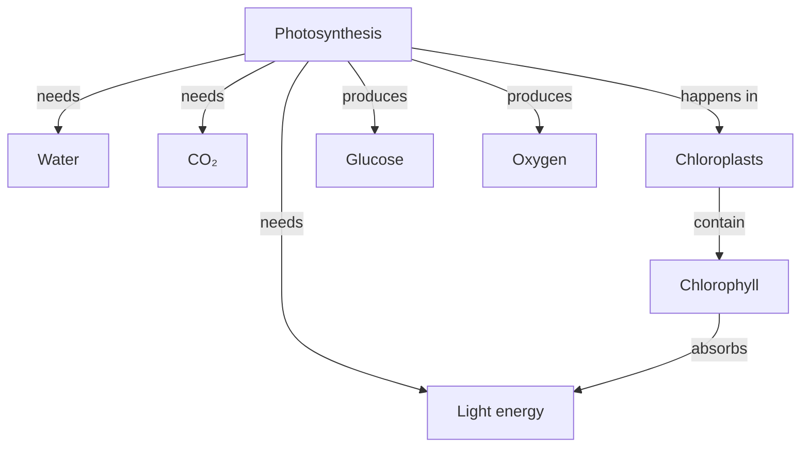

# concept-map

Turn a topic string or source text into a legible graph that shows structure at a glance. Default output is Mermaid syntax (renders in GitHub, Notion, Obsidian, and Claude Code with zero install) plus a PNG/SVG when a renderer is available.

## When to trigger

Activate on any phrasing that asks to *visualize relationships between ideas*. Examples:

### Student phrasings
- "mind map of the french revolution"
- "concept map for photosynthesis"
- "show me how these ideas relate"
- "visualize this chapter as a graph"
- "map my notes on cell biology"
- "I need a mind map to study for my exam"

### Teacher phrasings
- "diagram of this chapter for my 7th graders"
- "prerequisite tree for calculus"
- "cause and effect map of WWI"
- "draw a taxonomy of vertebrates"
- "flowchart the scientific method"
- "timeline of the civil rights movement"
- "markmap of my unit notes"

### Anti-triggers — DO NOT invoke
- "write me a summary of X" → plain prose, not a graph.
- "give me a flowchart for this React component" → code-diagramming, out of scope.
- "draw a picture of a cell" → labeled illustration, not a concept graph.

## Inputs

- **Topic string** *(required OR source)* — "the French Revolution", "photosynthesis", "derivatives".
- **Source text** *(required OR topic)* — pasted chapter, notes, or article paragraphs.
- **Graph type** *(optional)* — `tree`, `concept-map`, `flow`, `timeline`, `mindmap`. Inferred if omitted (see table below).
- **Format** *(optional)* — `mermaid` (default), `dot`, `markmap`, or `all`.
- **Grade / level** *(optional)* — K-2, 3-5, 6-8, 9-12, college, grad. Drives node count + vocabulary.
- **Max nodes** *(optional)* — integer, default 20, hard cap 50.
- **Render** *(optional, default true)* — auto-invoke `scripts/render.py` to produce PNG/SVG.

## Inferring graph type from phrasing (before asking)

Pick the graph type from the user's wording — do NOT ask unless both topic and format are absent.

| Phrasing cue | Graph type | Mermaid directive |
|---|---|---|
| "timeline of", "history of", "events leading up to", "chronology" | timeline | `timeline` |
| "parts of a ___", "anatomy of", "taxonomy of", "types of", "classification" | tree (hierarchical) | `graph TD` |
| "prerequisite tree", "what do I need before", "dependency graph" | tree (bottom-up DAG) | `graph BT` or DOT `rankdir=BT` |
| "causes of ___", "cause and effect", "what led to" | concept map with labeled edges | `graph LR` with edge labels |
| "how does ___ work", "process of", "steps in", "scientific method" | flow (process) | `flowchart LR` |
| "mind map of", "brainstorm", "everything about ___", "map my notes" | radial mindmap | `mindmap` |
| "concept map", "how these ideas relate", "relationships between" | Novak concept map | `graph TD` with labeled edges + cross-links |
| "markmap", "outline of my notes", "heading tree" | Markmap | Markdown headings |

If both topic AND format are missing, ask ONE clarifying question in this exact shape:

> Quick check — what topic, and which flavor? (e.g. **mind map of the French Revolution · concept map for photosynthesis · prerequisite tree for calculus · timeline of WWII**)

Do not stack questions. Once the user answers, proceed straight to generation.

## Grade / level calibration

| Level | Nodes | Structure | Edge labels |
|---|---|---|---|
| K-2 | 3-5 | Simple radial mindmap | None (lines only) |
| 3-5 | 6-10 | Hierarchical tree | Simple ("is a", "has") |
| 6-8 | 10-15 | Tree or concept map | Verbs ("causes", "requires") |
| 9-12 | 15-25 | Concept map with cross-links | Full labeled propositions |
| College | 20-40 | Concept map, multiple clusters | Rich labels |
| Grad | Up to 50 | Concept map + subgraphs / process flows | Precise terminology |

Vocabulary tracks level: K-2 uses common words, grad uses domain-precise terms.

## Workflow

1. **Parse** the request — extract topic OR source, graph type, format, grade.
2. **Infer** graph type from the table above if not specified. Default format is Mermaid.
3. **Extract** 10-30 candidate key concepts. Respect `max-nodes`.
4. **Cluster** related concepts; pick the root / central concept.
5. **Draft relationships.** For concept maps, label every edge with a verb or preposition ("causes", "is-a", "requires", "leads to"). See `references/novak-concept-maps.md`.
6. **Emit syntax** — write the chosen format to disk (`concept-map.mmd` by default).
7. **Render** — if `render: true`, invoke `scripts/render.py --input concept-map.mmd --output concept-map.png`. Script falls back to install hints if the CLI is missing; the syntax file is always preserved.
8. **Summarize** — return root concept, node count, edge count, and file paths.

## Locked defaults

| Setting | Default |
|---|---|
| Format | Mermaid (`graph TD` or per inference table) |
| Render | Auto-invoke `scripts/render.py` when the user asks for a rendered image; otherwise emit syntax + one-line render instructions |
| Max nodes | 20 (hard cap 50) |
| Cross-links | Enabled for grades 9-12 and above |
| Edge labels | Required for concept maps, optional for trees, off for K-2 mindmaps |
| Output bundle | `.mmd` + `.png` + render instructions |

## Micro-example

**User:** "concept map for photosynthesis, 7th grade"

**Inferred:** grade 7, concept map with labeled edges, Mermaid `graph TD`, ~10 nodes.



6 core nodes + 2 supporting nodes, every edge labeled, root is the central concept. Emit the raw Mermaid above as `concept-map.mmd`, then run `scripts/render.py` for a PNG.

## Rendering

Run the bundled script from the skill root:

```bash
python3 scripts/render.py --input concept-map.mmd --output concept-map.png
```

Dispatch by file extension:
- `.mmd` / `.mermaid` → `mmdc` (Mermaid CLI)
- `.dot` / `.gv` → `dot` (Graphviz)
- `.md` → `markmap-cli` (Markmap)

If the required CLI is missing, `render.py` exits 0 (non-fatal), prints platform-specific install commands, and points at https://mermaid.live/edit as a zero-install fallback. The syntax file is always preserved.

## References (load on demand)

- `references/graph-type-guide.md` — decision tree for picking tree / concept-map / flow / timeline / mindmap.
- `references/mermaid-cheatsheet.md` — `graph TD`, `flowchart LR`, `mindmap`, `timeline`, node shapes, edge labels, subgraphs, styling.
- `references/dot-cheatsheet.md` — DOT syntax, `digraph`, `rankdir`, clusters, `dot`/`neato`/`fdp` layouts.
- `references/markmap-syntax.md` — Markdown-heading-driven mind maps, frontmatter options.
- `references/novak-concept-maps.md` — Novak & Cañas theory: propositions (concept-link-concept), focus questions, cross-links, hierarchical layout.
- `references/node-labeling.md` — label length, noun-nodes / verb-edges, reading-level calibration.

Load a reference only when its topic is active — never preload.

## Quality bar

Every generated graph must satisfy:

- Syntax parses in its target renderer (no Mermaid parse errors, valid DOT, valid Markmap).
- Root / central concept is unambiguous and matches the user's topic.
- Node count matches the grade calibration (±20%).
- For concept maps at grades 6+, every edge carries a verb or preposition label.
- Labels are ≤ 3 words where possible; nouns for nodes, verbs for edges.
- No hallucinated concepts when a source text is provided — each node maps to a substring or close paraphrase in the source.
- Rendered image is non-empty OR install hints are surfaced with a zero-install fallback URL.

## What NOT to do

- Do not emit a graph with > 50 nodes — cluster lowest-importance concepts into parent groups and report what was collapsed.
- Do not leave edges unlabeled in concept maps for grades 6+.
- Do not silently pick one direction when source text supports both (A causes B *and* B causes A) — emit both with distinct labels.
- Do not fail hard when renderers are missing — always fall back gracefully and keep the syntax file.
- Do not ask more than one clarifying question.
