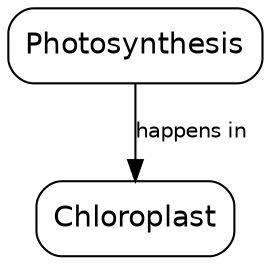
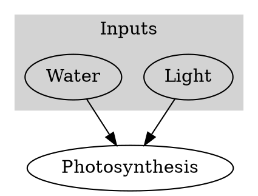

# Graphviz DOT cheatsheet

Use DOT when Mermaid's layout gets cramped — typically dense concept maps (25+ nodes) or prerequisite DAGs where you want precise layout control.

## Skeleton



Use `graph G {}` with `--` instead of `->` for undirected graphs.

## Node attributes

```
[shape=box | ellipse | circle | diamond | plaintext | record]
[style=rounded | filled | bold | dashed]
[fillcolor="#e0f7ff"]
[color=gray]
[label="Label with\nnewline"]
[width=1.5, height=0.6, fixedsize=true]
```

## Edge attributes

```
A -> B [label="causes", color=red, style=dashed, arrowhead=open]
```

- `arrowhead`: `normal`, `open`, `vee`, `diamond`, `none`.
- `style`: `solid`, `dashed`, `dotted`, `bold`.
- `minlen=2` forces longer edge (useful to control layering).

## Clusters (subgraphs)



Cluster names MUST start with `cluster_` for Graphviz to draw the box.

## Layouts (choose via `-K` or shebang)

| Layout | Best for | CLI |
|---|---|---|
| `dot` | Hierarchical, directed | `dot -Tsvg in.dot -o out.svg` (default) |
| `neato` | Undirected, force-directed | `neato -Tsvg in.dot -o out.svg` |
| `fdp` | Large undirected | `fdp -Tsvg in.dot -o out.svg` |
| `twopi` | Radial | `twopi -Tsvg in.dot -o out.svg` |
| `circo` | Circular | `circo -Tsvg in.dot -o out.svg` |

`scripts/render.py` uses `dot` by default. For radial mind maps, generate via `twopi` directly.

## Rank control (hierarchy tuning)

```dot
{ rank=same; Algebra; Geometry; }   // force same horizontal level
{ rank=min; Arithmetic; }           // pin to top
{ rank=max; Calculus; }             // pin to bottom
```

## Common pitfalls

- Node IDs with spaces must be quoted: `"Bastille Day" -> Revolution`.
- HTML-like labels: `label=<<b>Bold</b> part>` — angle brackets, no quotes around the outer `<>`.
- Large graphs: increase `ranksep=1.0` and `nodesep=0.5` to reduce overlap.
- If `dot` produces tangled edges, try `neato -Goverlap=false` or `fdp`.
