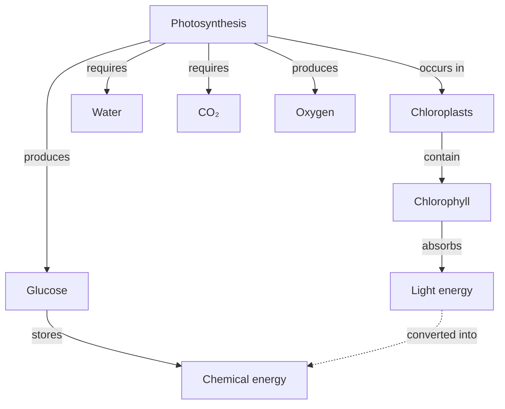

# Novak & Cañas concept maps

Joseph Novak (Cornell, 1970s) and later Alberto Cañas codified **concept mapping** as a specific graph-based representation of meaningful learning. It is not the same as a mind map. Use this reference when the user says "concept map" specifically or when building a Novak-style map for grades 6+.

## Core theory

1. **Proposition = concept + linking phrase + concept.** The atomic unit of a concept map is a short sentence: *"Photosynthesis — produces — Glucose"*. Concepts are nouns; linking phrases are verbs or prepositions.
2. **Hierarchical layout.** The most general / inclusive concept goes at the top; more specific concepts fan downward.
3. **Cross-links.** Lines that jump between branches surface non-obvious relationships. Cross-links are the hallmark of deep understanding and distinguish a concept map from a tree.
4. **Focus question.** A well-made concept map answers a specific focus question, stated at the top: *"What does a plant need to make food?"* — not just "Photosynthesis".
5. **Progressive differentiation.** Start with a few general concepts, then differentiate into more specific ones as you go down.

## The Novak checklist

A Novak-compliant concept map:

- [ ] States a focus question.
- [ ] Has a clear root at the top (most general concept).
- [ ] Uses labeled links (verbs / prepositions) on **every** edge.
- [ ] Has at least one cross-link across branches at grades 9+.
- [ ] Concepts are single nouns or short noun phrases (≤ 3 words).
- [ ] Linking phrases are ≤ 3 words (verbs ideal).
- [ ] Reads like a collection of sentences when you trace any path.

## Example (photosynthesis, 9th grade)

Focus question: *"How do plants convert light into stored chemical energy?"*

The dotted `L -.-> E` is a cross-link — it ties light energy (upper branch) to chemical energy (lower branch) without following the hierarchy.

## Linking-phrase catalog

Prefer specific verbs over "is related to":

| Relationship | Good linking phrase |
|---|---|
| Causation | causes, leads to, triggers, produces |
| Composition | is made of, contains, includes |
| Taxonomy | is a, is a type of, is a kind of |
| Requirement | requires, needs, depends on |
| Result | results in, yields, creates |
| Location | occurs in, found in, located in |
| Time | precedes, follows, occurs during |
| Opposition | contrasts with, opposes, differs from |

Never use "relates to", "goes with", or "has something to do with" — they carry no information.

## Cross-link threshold by grade

| Grade | Cross-links |
|---|---|
| K-5 | None (cognitive load too high) |
| 6-8 | 1-2 optional; label clearly |
| 9-12 | 2-4 expected; use dotted edges to distinguish |
| College+ | 3-8; group-color cross-links by relationship type |

## Assembly procedure

1. Write the focus question.
2. Brainstorm 15-25 concepts on sticky notes / a list.
3. Rank concepts by generality; the most general is the root.
4. Draft the hierarchy top-down.
5. Add linking phrases to every edge.
6. Look across branches — what pairs connect? Add cross-links.
7. Review: can every path be read as a meaningful sentence?
