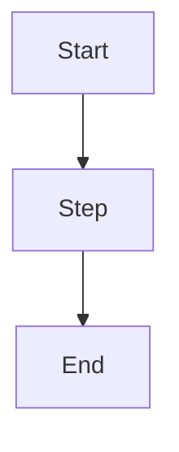

# Output Format Skeleton

Exact markdown skeleton for the generated study guide. Follow this structure in the order below.

## Filename

`study-guide-<topic-slug>-<YYYY-MM-DD>.md` in the user's cwd.

- `<topic-slug>` is `kebab-case-lowercase`, ≤ 40 chars, derived from the primary topic. For multi-lecture: `<course-slug>-weeks-<A>-<B>`.
- `<YYYY-MM-DD>` is today's date in ISO format.

## Document template

````markdown
# Study Guide: <Topic Title>

_Generated <YYYY-MM-DD> from <source description>. Level: <grade level>._

## 1. Outline

- [1. Outline](#1-outline)
- [2. Key Terms](#2-key-terms)
- [3. Concept Summaries](#3-concept-summaries)
  - [3.1 <Topic Group 1>](#31-topic-group-1)
  - ...
- [4. Diagrams](#4-diagrams)
- [5. Worked Examples](#5-worked-examples)
- [6. Practice Questions](#6-practice-questions)
- [7. Cheat Sheet](#7-cheat-sheet)

## 2. Key Terms

| Term | Definition | Source |
|---|---|---|
| ... | ... | ... |

## 3. Concept Summaries

### 3.1 <Topic Group 1>

*Question: <SQ3R-style question this section answers>*

<2–5 short paragraphs.>

**In your own words:** <one-line Recite.>

*See PQ <numbers>.*

### 3.2 <Topic Group 2>
...

## 4. Diagrams



<Brief caption explaining the diagram.>

## 5. Worked Examples

### Example 1: <Title>

**Problem:** <problem statement, LaTeX where needed>

1. <Step 1.>
   *(<why>)*
2. <Step 2.>
   *(<why>)*
...

**Answer:** <final>

## 6. Practice Questions

1. <Question.> *(<source citation>)*

   <details><summary>Answer</summary>
   <answer>
   </details>

2. ...

## 7. Cheat Sheet

| Cue | Note |
|---|---|
| <keyword> | <one-line> |
| ... | ... |

**Top 5 terms:** <term1>, <term2>, <term3>, <term4>, <term5>.

**Key formulas:** $<formula>$, $<formula>$.

> **Synthesis:** <2-3 sentence tie-together.>
````

## Validation checklist before writing the file

- All 7 numbered sections present.
- TOC anchor links resolve (`#N-section-name` form, lowercase, hyphens).
- Key Terms table has ≥ 5 rows (see `term-extraction.md` for min/target/max).
- At least one Mermaid code block in Diagrams (unless content is fundamentally non-diagrammable — prose literature analysis, poetry — in which case include a short justification: *"No diagrams applicable for this material."*).
- Practice Questions count meets `question-mix.md` minimums.
- Cheat Sheet ≤ 500 words for college/grad, ≤ 700 words for 6-8/9-12.
- All LaTeX math uses `$...$` (inline) or `$$...$$` (block), never unicode substitution for operators.

## Flashcard CSV inline block (opt-in)

If the user asks for flashcards inline (V1 does not auto-invoke the flashcards skill):

```csv
front,back,type
"Define metaphase","Stage of mitosis where chromosomes align at the equatorial plane","front-back"
"{{c1::Metaphase}} is the stage where chromosomes align at the equator","","cloze"
```

End the guide with a single suggestion line:
`> For Anki/Quizlet export, run the flashcards skill on this file next.`
